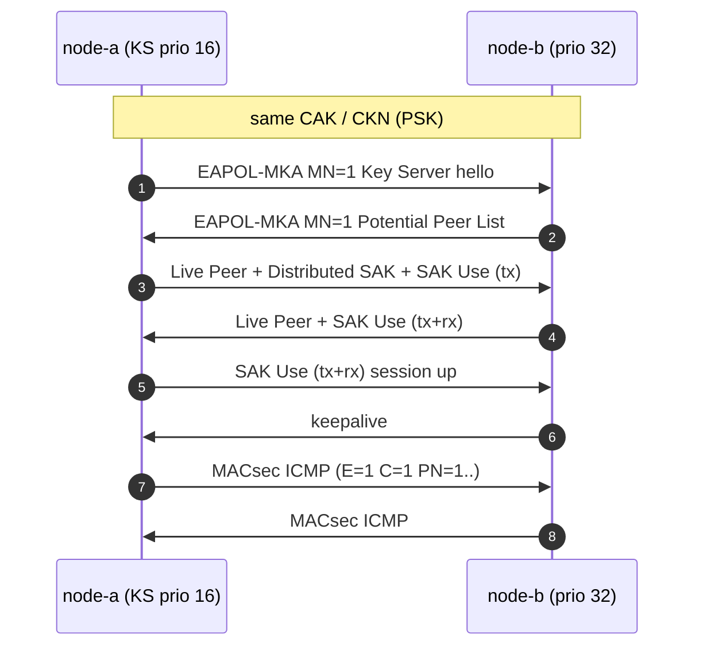

## 1.2 MACsec 在网络栈中的位置

"链路层加密"四个字听起来简单，但 MACsec 与 IPsec、TLS 的分层差异决定了它的一切行为特征：逐跳保护、对上层透明、不需要 IP。本节把 MACsec 放进协议栈里看清楚，并预览抓包里将看到的两类流量。

### 1.2.1 链路层的一席之地

MACsec 工作在以太网链路层：发送方在以太网头与载荷之间插入 SecTAG 并保护载荷，接收方验证、解包后还原成普通帧继续向上层递交。两个 EtherType 划分了两个平面：

| EtherType | 平面 | 承载 |
|---|---|---|
| `0x888E` | 控制面 | EAPOL，其中 Packet Type **5** 是 MKA（Key Server 选举、SAK 分发） |
| `0x88E5` | 数据面 | MACsec 受保护帧（SecTAG + Secure Data + ICV） |

对上层完全透明：IP 栈及其上的应用不感知 MACsec 的存在。MKA 是纯链路层协议（EAPOL 组播），两台设备对口即可运行，连 IP 都可以不配——这是它与 IPsec/WireGuard 的根本差异（详见[第十二章](../12_comparison/README.md)）。

### 1.2.2 抓包里能看到什么

本书实验室的 15 个参考抓包覆盖两个平面，外加 IEEE 官方向量对照：

| 平面  | 协议               | 抓包里有什么                                                                                              |
| --- | --- | --- |
| 控制面 | **MKA**（KaY）     | Key Server 选举、CKN、Live/Potential Peer List、KEK 封装的 **Distributed SAK**、**SAK Use**、AES-CMAC **ICV** |
| 数据面 | **MACsec**（SecY） | EtherType `0x88E5`、SecTAG（TCI/AN/SL/PN/SCI）、Secure Data、GCM **ICV**                                 |
| 对照  | IEEE 官方向量        | 公开的 GCM-AES-128/256 完整性 / 机密性测试帧，本仓库测试会逐字节比对 ICV                                                        |

### 1.2.3 一条 PSK 会话的样子

两端事先配好同一把 CAK/CKN（PSK 模式），MKA 直接开始。`captures/session-full.pcap` 完整记录了这样一条会话：

前三条消息完成互相发现与 Key Server 选举；第四、五条里 Key Server 分发 SAK（用 KEK 包裹），双方装好后互告 SAK Use，会话建立；随后的 ICMP 已经在用新 SAK 加密。这条故事线的逐帧字节级解析是[第五章](../05_wire_format/5.3_control_plane_frames.md)的主角。

EAP 鉴权成功之后的故事（`mka-after-eap.pcap`）参数集完全相同，但 CAK/CKN 从 EAP 的 MSK 派生、Authenticator 当 Key Server——两条路线的分岔点见 [5.5 节](../05_wire_format/5.5_psk_vs_eap.md)。
