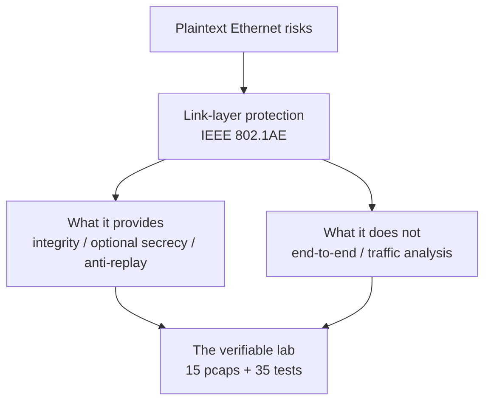

# 第一章 初识 MACsec

以太网是数据中心、运营商网络与企业园区的骨干，但原生以太网帧是明文的：任何能接触到链路的设备都可以读取、篡改、重放流量。MACsec（IEEE 802.1AE）在链路层为以太网补上了这一课，而它的密钥自动化由 802.1X 体系中的 MKA 协议完成。本章是全书的入口，帮助读者在进入字节与密钥细节之前，先建立对 MACsec 的整体认知。

本章主要内容包括：

- **1.1 明文以太网的风险：为什么需要 MACsec**：从嗅探、篡改、重放三重威胁出发，理解链路层加密的动机
- **1.2 MACsec 在网络栈中的位置**：链路层定位、两个 EtherType、一条会话在抓包里的样子
- **1.3 能做什么，不能做什么**：安全服务清单与能力边界，避免对二层加密的常见误解
- **1.4 本书与实验室：可验证的知识库**：15 个抓包、35 项测试与字段级报告如何构成"证据链"

通过本章的学习，读者将能够说清楚 MACsec 解决什么问题、在协议栈的哪一层工作、能提供与不能提供哪些安全服务，并知道如何用配套实验室验证书中的每一个论断。

