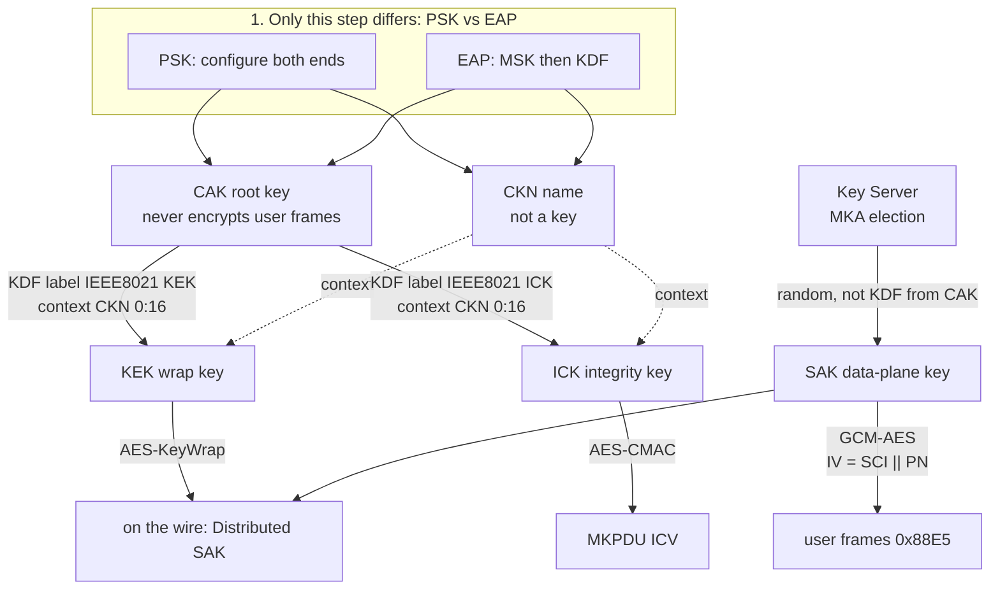

## 2.2 生成关系：CAK 从哪里来

五个对象不是孤立的，而是一张从"身份"到"流量"的派生图。这张图里只有第一步存在两条路线——PSK 直接配置，EAP 从 MSK 派生——之后的每一步两条路线完全相同。看懂这张图，密钥体系就掌握了一半。

### 2.2.1 派生全景图

图 2-1：密钥派生全景（PSK 与 EAP 只在第一步不同）

### 2.2.2 只有第一步不同：PSK vs EAP

图中最上方的虚线框是全书反复出现的对照：**PSK 与 EAP 只在「CAK/CKN 从哪来」这一步不同**；之后的 MKA（选 KS、Distributed SAK、SAK Use）完全相同。这意味着：

- 运维上换鉴权方式（预共享 → 802.1X），数据面的行为、报文格式、换钥流程都不变；
- 抓包上看，两条故事线的 MKPDU 参数集一模一样，区别只在时间线上有没有 EAP-Success 前置、以及谁当 Key Server（详见 [8.2 EAP 鉴权成功之后](../08_topology/8.2_after_eap.md)与 [5.5 PSK 与 EAP 鉴权之后的 MKA](../05_wire_format/5.5_psk_vs_eap.md)）。

### 2.2.3 SAK：唯一由 Key Server 随机生成的密钥

再看图右下这条支线：SAK 的箭头来自 Key Server，而不是 CAK。Key Server 由 MKA 选举产生（见 [4.3 Key Server 选举](../04_mka/4.3_ks_election.md)），它随机生成一把 SAK，用 KEK 做 AES-KeyWrap 封装后放进 Distributed SAK 参数集广播；对端 unwrap 后交给各自的 SecY。换钥时，Key Server 再随机发一把（见 [6.2 换钥时线上发生什么](../06_lifecycle/6.2_rekey_on_wire.md)）。

实验室为可复现抓包，PSK / EAP 两条故事线各固定了一把演示 SAK（在 [`captures/keys.json`](../captures/keys.json) 里可见）；真实实现里 SAK 每次由 KS 随机产生。
