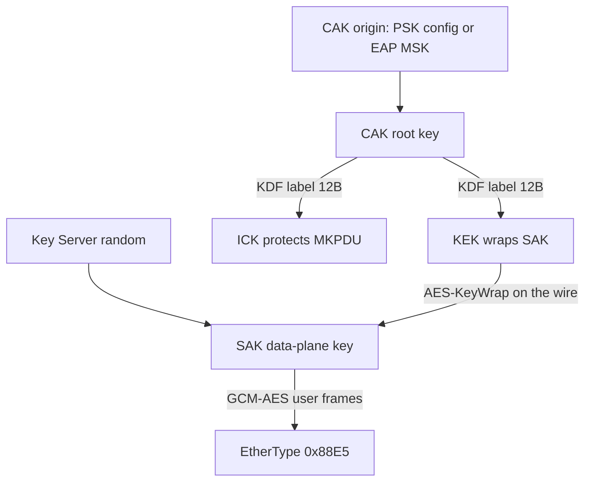

# 第二章 密钥体系：从 CAK 到 SAK

任何加密系统的强度，最终都不取决于算法，而取决于密钥如何生成、分发与使用。MACsec 在这方面显得格外"讲究"：它不用一把钥匙包打天下，而是定义了五个各司其职的密钥对象，让根密钥永远不接触用户流量。本章是全书的地基——后面看报文、看换钥、看攻击面，都会不断回到这张密钥关系图上。

本章主要内容包括：

- **2.1 五个密钥对象：CAK/CKN/KEK/ICK/SAK**：每个对象是什么、从哪里来、负责什么
- **2.2 生成关系：CAK 从哪里来**：PSK 与 EAP 两条路线的派生全景图
- **2.3 KDF 公式与标签**：AES-CMAC KDF 的精确公式，以及标签字节长度这个易错细节
- **2.4 两条平面：控制面与数据面**：哪把钥匙保护哪条平面，为什么 CAK 从不加密用户帧

通过本章的学习，读者将能够分清五个密钥对象的角色与派生关系，读懂 `captures/keys.json` 里的每一个字段，并在抓包中指出"这帧里用的是哪把钥匙"。

