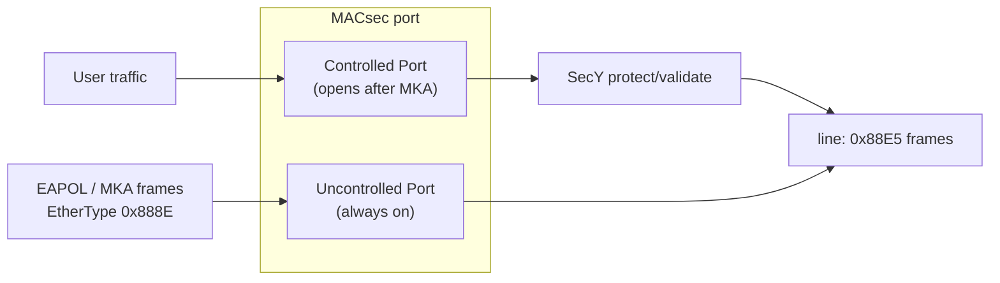

## 3.1 受控口与非受控口

MACsec 不是把整个端口"加密化了事"。在 802.1AE 的桥接模型里，每个使能 MACsec 的端口被拆成两个逻辑口：一个永远开放、专门走密钥协商流量；另一个只有在会话建立后才对用户流量打开。理解这个拆分，是理解 MACsec"先有鸡还是先有蛋"问题的关键。

### 3.1.1 两个逻辑口

图 3-1：受控口与非受控口

### 3.1.2 为什么非受控口必须永远放行 EAPOL

**非受控口**永远放行 EAPOL（含 MKA）——否则鸡生蛋问题：加密密钥的协商流量自己就被拦了。PAE 组地址 `01:80:C2:00:00:03` 的帧也因此不被网桥转发；在 Linux 网桥上做实验时需要设置 `group_fwd_mask`，否则 MKA 根本到不了对端（踩坑记录见 [10.5 排障指南](../10_lab/10.5_troubleshooting.md)）。

### 3.1.3 受控口与 fail-close

**受控口**只有在 MKA 会话建立（双方 SAK Use 都 tx+rx）之后才对用户流量"打开"。MKA 停了，受控口随之关闭——这就是 fail-close 的标准行为：宁可断流量，不放明文。会话消失后数据面的完整命运，见 [6.5 保活、判死与数据面存亡](../06_lifecycle/6.5_liveness.md)。
