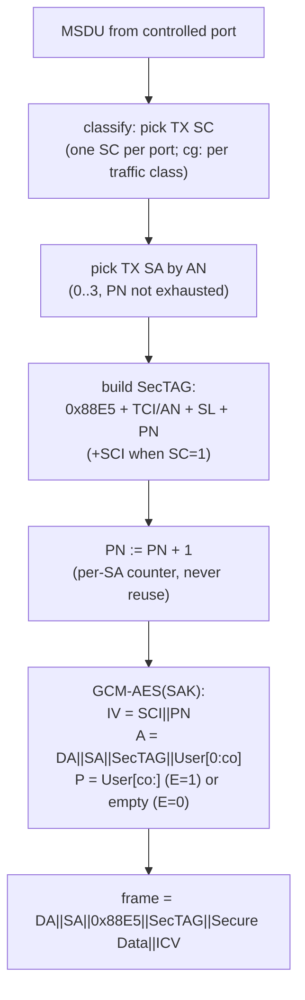

## 3.2 发送路径：一帧如何被保护

一帧用户数据从受控口进来，到变成线上的 `0x88E5` 帧，SecY 依次做六件事。这六步里藏着 MACsec 最重要的几条安全规则：PN 绝不复用、AAD 覆盖全部头部、加密范围由 E 位与 co 共同决定。

### 3.2.1 六步流水线

图 3-2：发送路径六步

### 3.2.2 逐步对照实验室

每一步都可以在抓包与代码上验证（逐帧解析见 [5.3 控制面六帧](../05_wire_format/5.3_control_plane_frames.md)与 [5.4 数据面七帧](../05_wire_format/5.4_data_plane_frames.md)）：

| 步骤 | 规则要点 | 实现映射 |
|---|---|---|
| 选 SC/SA | 每个发送方向一个 SC（SCI = MAC‖PortID）；换钥时 AN 0→1→2→3 轮转（[6.2 换钥时线上发生什么](../06_lifecycle/6.2_rekey_on_wire.md)） | `SecTAG.build(an=…)` |
| SecTAG | 点对点可 ES=1 省略 SCI（8 字节都省）；多成员 CA 必须 SC=1 带上 SCI | `macsec-lab-encrypted.pcap` 帧 7 vs `mka-multi-peer.pcap` |
| PN | 每个 SA 独立从 1 递增；**同一 SAK 内绝不复用**（nonce 复用会击穿 GCM）；XPN 64 位，线上只带低 32 位 | `XpnPnTracker` |
| AAD | DA‖SA‖**EtherType 0x88E5**‖SecTAG‖User[0:co] 全部认证——改任何一个 bit ICV 都会挂 | `crypto.gcm_protect` |
| 加密范围 | E=1：User Data（或 co 之后）加密；E=0：P 为空只做完整性；co∈{0,30,50} 由 MKA 协商不在帧里 | `mka-co30.pcap` |
| ICV | 16 字节 GCM tag 追加帧尾 | 所有抓包 |

其中"PN 绝不复用"一条值得单独强调：GCM 的 IV = SCI‖PN，同一 SAK 下 IV 重复意味着 nonce 复用，这在密码学上是灾难性的（见 [9.2 GCM nonce 复用](../09_attacks/9.2_nonce_reuse.md)）。发送端的每 SA 计数器就是为此存在的。
