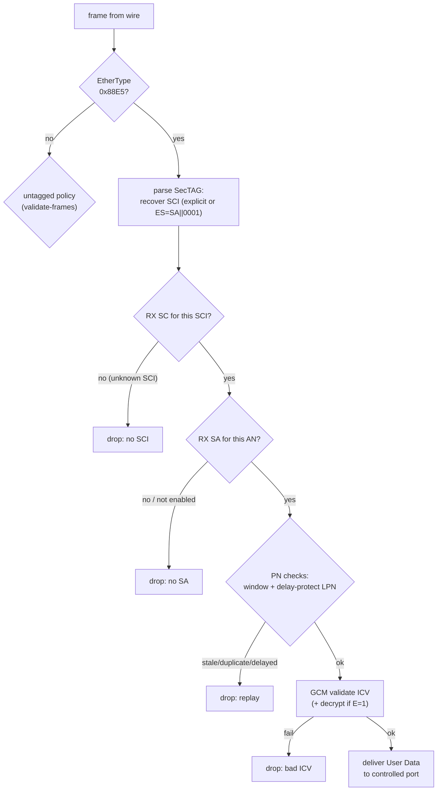

## 3.3 接收路径：一帧要过几道关

接收方向是 MACsec 安全性的主战场：攻击者伪造的、重放的、延迟送到的帧，都要在这里被拦下。802.1AE 为每帧设置了五道关，而且定下一条冷峻的规矩——**任何一道失败都是静默丢弃**。标准不要求回错误报文，因为回话本身就会泄露信息（哪些帧被检查过、检查到什么程度）。

### 3.3.1 五道关

图 3-3：接收路径五道关

### 3.3.2 关卡与实验室演示对照

| 关卡 | 依据 | 实验室演示 |
|---|---|---|
| 未知 SCI | 帧不属于任何已建立的 RX SC（对端还没分发 SAK / 伪造 SCI） | 概念层：`parse_frame` 的 `sci_hint` 失败路径 |
| 无 SA / AN 未启用 | SCI 对但该 AN 没有**启用中**的 SA（换钥过渡期常见） | `mka-rekey.pcap` 双 SA 并存 |
| 重放窗口 | [6.3 抗重放窗口：四种裁决](../06_lifecycle/6.3_replay_window.md) | `macsec-replay.pcap` + `ReplayWindow` |
| Delay Protect | PN < 对端宣告 LLPN → 丢弃 | `mka-delay-protect.pcap` + `set_delay_floor()` |
| ICV | GCM tag 校验失败 → 丢弃 | `tests` 的 tamper 用例（翻 1 个 bit 必挂） |

注意五道关的顺序是有讲究的：先查"这帧属于谁"（SCI）、再查"这个方向启用了吗"（SA/AN）、再查"序号新鲜吗"（PN）、最后才做昂贵的密码学运算（ICV/解密）。让伪造帧在最便宜的关卡上被丢弃。

### 3.3.3 XPN 的接收差异

XPN 的接收差异只有一处：线上 PN 是 64 位中的低 32 位，接收端用 SA 状态恢复高 32 位（大步回跳=回绕，小步回跳=乱序），nonce 是 (SSCI‖PN64)⊕Salt 而非 SCI‖PN——见 [7.3 XPN：64 位 PN 与 nonce 重构](../07_cipher_suites/7.3_xpn.md)与 `mka-xpn.pcap`。
