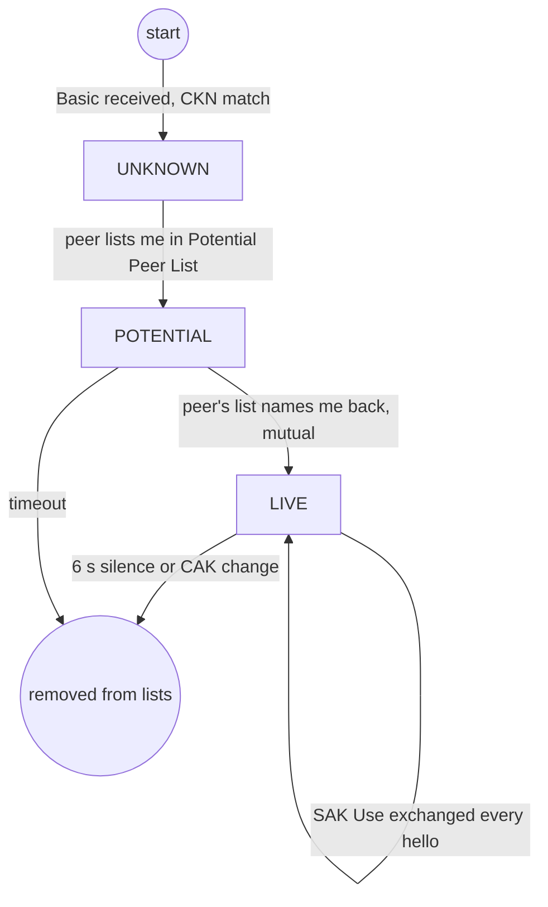

## 4.4 对等体生命周期：Potential → Live

信任在 MKA 里是渐进建立的：我先"看见"你，然后确认你也"看见"了我，双向确认之后才把你当作 Live 对等体、开始采信你的宣告。每个成员为**每个远端成员**维护一条这样的状态：

图 4-1：对等体状态迁移

- **Potential**：我看见了它，它还没确认看见我（或还没互认）。出现在 **Potential Peer List**（类型 2）。
- **Live**：双方互相列名，开始信任其宣告。出现在 **Live Peer List**（类型 1）。
- 晋级的可观测信号：[`mka-handshake.pcap`](../captures/mka-handshake.pcap) 里 B 的 MN=1 只发 Potential List（帧 2），A 的 MN=2 起改发 Live List（帧 3）——A 先在 Basic/列表里点名了 B，B 确认后对等关系成立。逐字段对照见[附录 D.01](../captures/decoded/01-mka-handshake.md)。

判死同样可观测：Live 对端约 6 秒没有报文，就从列表里消失，受控口随之关闭——这条链路在 [6.5 节](../06_lifecycle/6.5_liveness.md)展开。
