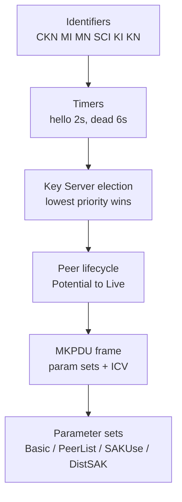

# 第四章 MKA 协议详解

MACsec 的数据面只认 SAK，但 SAK 从哪里来、由谁说了算、邻居是否还活着——这些问题全部交给控制面 MKA（MACsec Key Agreement，IEEE 802.1X Clause 9/11）来回答。它选举 Key Server、分发 SAK、宣布"我在用哪把钥匙"、维持邻居存活，是 MACsec 能够"配好就忘"的幕后机制。

本章把 MKA 当作参考手册逐层展开：从标识符与时间参数，到选举与对等体状态机，再到 MKPDU 的帧结构与全部参数集。每张表都标注了实验室抓包里的对应位置，读完即可拿着 Wireshark 逐字段核对。建议先读[第二章](../02_key_hierarchy/README.md)建立密钥体系的整体图景，再回到本章查表。

本章主要内容包括：

- **4.1 标识符一览：MI/MN/SCI/KI/KN**：MKA 世界里的七个名字各自标识什么、如何生成与变化
- **4.2 时间参数**：hello 周期、判死时限、SAK 与 CAK 的寿命
- **4.3 Key Server 选举**：谁当 KS、优先级怎么比、为什么只有一个当选者
- **4.4 对等体生命周期：Potential → Live**：从"我看见它"到"互相信任"的状态迁移
- **4.5 MKPDU 帧结构与最小合法内容**：EAPOL 里的四段头与一条 keepalive 的最小集
- **4.6 参数集逐个参考**：Basic / Peer List / SAK Use / Distributed SAK 及其他的逐字段表

通过本章的学习，读者将能够读懂任意一条 MKPDU 的每个字段，并理解 MKA 如何在无人值守的情况下维系整条 MACsec 链路。

