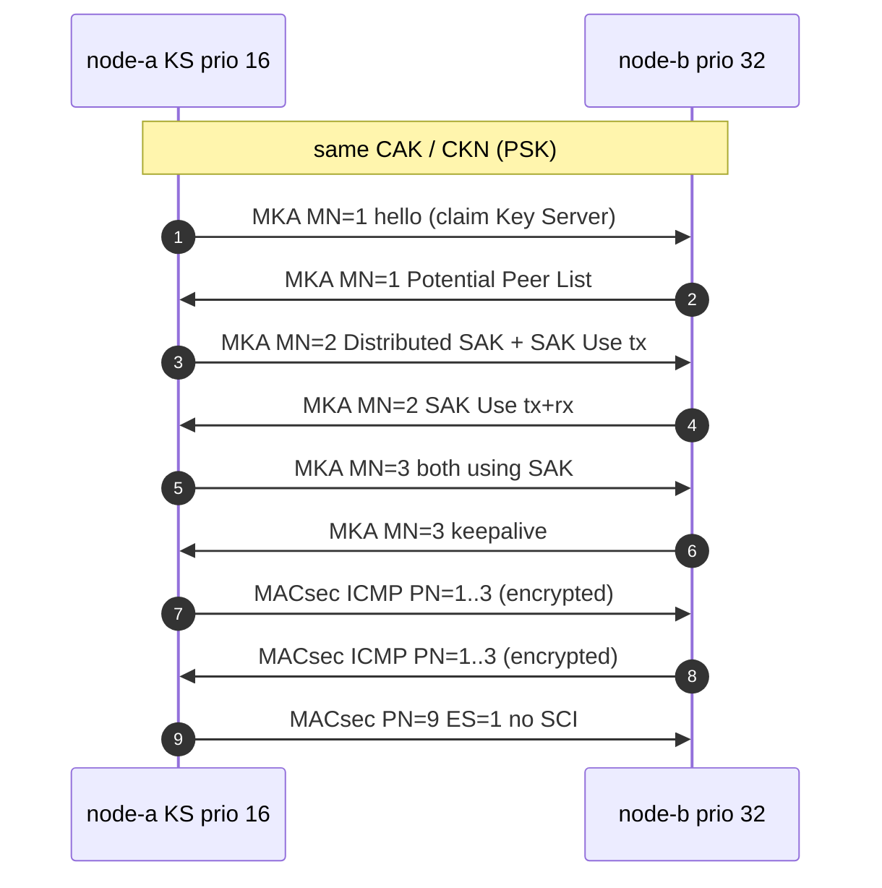

## 5.3 控制面六帧：MKA 握手逐帧解析

格式只是词汇，会话才是句子。本节按时间顺序拆解 [`session-full.pcap`](../captures/session-full.pcap) 的前 6 帧——一次 PSK 模式下的完整 MKA 握手：A 与 B 事先共享 CAK/CKN，从互不相识到双方用同一把 SAK 收发。字段值与 `make generate` 生成的 [字段级报告](../captures/decoded/06-session-full.md) 同源（同一套解析器），可在 Wireshark 中过滤 `mka || macsec` 逐帧对照，密钥见 [`captures/keys.json`](../captures/keys.json)（演示密钥，公开）。



图 5-1：PSK 会话全过程时序（控制面 6 帧 + 数据面 7 帧）

### 总览

| # | 长度 | SA → DA | 一句话 |
|---:|---:|---|---|
| 1 | 82 | `02:00:00:00:00:0a` → `01:80:c2:00:00:03` | A MN=1 hello (claim Key Server, no peers yet) |
| 2 | 102 | `02:00:00:00:00:0b` → `01:80:c2:00:00:03` | B MN=1 hello (saw A; Potential Peer List; not Key Server) |
| 3 | 178 | `02:00:00:00:00:0a` → `01:80:c2:00:00:03` | A MN=2 Key Server: Live Peer List + Distributed SAK + SAK Use (tx) |
| 4 | 146 | `02:00:00:00:00:0b` → `01:80:c2:00:00:03` | B MN=2: Live Peer List + SAK Use (tx+rx) after installing SAK |
| 5 | 146 | `02:00:00:00:00:0a` → `01:80:c2:00:00:03` | A MN=3: both sides using SAK (tx+rx), session up |
| 6 | 146 | `02:00:00:00:00:0b` → `01:80:c2:00:00:03` | B MN=3 keepalive |

分文件报告（同一套解析器）：

- [captures/decoded/01-mka-handshake.md](../captures/decoded/01-mka-handshake.md)
- [captures/decoded/11-mka-after-eap.md](../captures/decoded/11-mka-after-eap.md) — EAP-Success 之后的 MKA（Authenticator 为 Key Server），见 [5.5 节](5.5_psk_vs_eap.md)
- [captures/decoded/13-mka-rekey.md](../captures/decoded/13-mka-rekey.md) — SAK 换钥：AN=0 → AN=1 全过程（`mka-rekey.pcap`），见[第六章](../06_lifecycle/README.md)

### 帧 1 — A MN=1 hello (claim Key Server, no peers yet)

**EAPOL-MKA  MN=1  Key Server  ICV=OK**

- 方向：`02:00:00:00:00:0a` → `01:80:c2:00:00:03`（82 B）
- 作用：A MN=1 hello (claim Key Server, no peers yet)
- Key Server 标志 = `True`，优先级 = `16`，MN = `1`
- ICV 校验 = `True`（AES-CMAC(ICK, DA‖SA‖0x888E‖EAPOL−ICV)）

看点：A 自荐 Key Server（KS=1、priority=16），此时还没有任何对等体——整帧只有 Basic Parameter Set（body length=44）加 ICV，是最短的合法 MKPDU 形态。

#### 逐字段（相对帧起始偏移）

| Offset | Len | Hex | Field | Value | 说明 |
|---:|---:|---|---|---|---|
| 0 | 6 | `0180c2000003` | DA | `01:80:c2:00:00:03` | PAE 组播（MKA 必须用组地址） |
| 6 | 6 | `02000000000a` | SA | `02:00:00:00:00:0a` | 发送方 MAC |
| 12 | 2 | `888e` | EtherType | `0x888e` | 802.1X EAPOL |
| 14 | 1 | `03` | EAPOL Version | `3` | 3 = 802.1X-2010 |
| 15 | 1 | `05` | EAPOL Type | `5` | 5 = EAPOL-MKA（不是 6） |
| 16 | 2 | `0040` | Packet Body Length | `64` | 含 ICV，不含以太网头 |
| 18 | 1 | `02` | MKA Version | `2` | Basic 第 1 字节是版本不是 type；2 = 802.1X-2010，3 = 802.1X-2020（XPN 的 KS SSCI 字段随 v3 出现） |
| 19 | 1 | `10` | Key Server Priority | `16` | 数值越小越优先 |
| 20 | 2 | `f02c` | KS/Desired/Cap + BodyLen | `0xf02c` | KS=1 Desired=1 Cap=3(完整性+机密性，offset 0/30/50) body_len=44 |
| 22 | 8 | `02000000000a0001` | SCI | `02000000000a0001` | MAC ‖ Port ID |
| 30 | 12 | `aa01aa02aa03aa04aa05aa06` | Actor MI | `aa01aa02aa03aa04aa05aa06` | 12 字节成员标识 |
| 42 | 4 | `00000001` | Actor MN | `1` | 本参与者报文序号 |
| 46 | 4 | `0080c201` | Algorithm Agility | `0080c201` | 00-80-C2-01 = 802.1X-2010 AES-CMAC |
| 50 | 16 | `4d41435345432d4c41422d434b4e3031` | CKN | `4d41435345432d4c41422d434b4e3031` | ASCII 'MACSEC-LAB-CKN01'，两端必须一致 |
| 66 | 16 | `71216e851900b42b0f9d5797f8938f98` | MKA ICV | `71216e851900b42b0f9d5797f8938f98` | AES-CMAC(ICK)；校验 通过 |

#### 十六进制

```
0000  01 80 c2 00 00 03 02 00  00 00 00 0a 88 8e 03 05  ................
0010  00 40 02 10 f0 2c 02 00  00 00 00 0a 00 01 aa 01  .@...,..........
0020  aa 02 aa 03 aa 04 aa 05  aa 06 00 00 00 01 00 80  ................
0030  c2 01 4d 41 43 53 45 43  2d 4c 41 42 2d 43 4b 4e  ..MACSEC-LAB-CKN
0040  30 31 71 21 6e 85 19 00  b4 2b 0f 9d 57 97 f8 93  01q!n....+..W...
0050  8f 98                                             ..
```

### 帧 2 — B MN=1 hello (saw A; Potential Peer List; not Key Server)

**EAPOL-MKA  MN=1  非 Key Server  ICV=OK**

- 方向：`02:00:00:00:00:0b` → `01:80:c2:00:00:03`（102 B）
- 作用：B MN=1 hello (saw A; Potential Peer List; not Key Server)
- Key Server 标志 = `False`，优先级 = `32`，MN = `1`
- ICV 校验 = `True`（AES-CMAC(ICK, DA‖SA‖0x888E‖EAPOL−ICV)）

看点：B 听到过 A，于是带上 **Potential Peer List**（type 2，含 A 的 MI/MN）；B 的 priority=32 大于 A 的 16，所以 KS=0——选举在这两帧里就已经完成。

#### 逐字段（相对帧起始偏移）

| Offset | Len | Hex | Field | Value | 说明 |
|---:|---:|---|---|---|---|
| 0 | 6 | `0180c2000003` | DA | `01:80:c2:00:00:03` | PAE 组播（MKA 必须用组地址） |
| 6 | 6 | `02000000000b` | SA | `02:00:00:00:00:0b` | 发送方 MAC |
| 12 | 2 | `888e` | EtherType | `0x888e` | 802.1X EAPOL |
| 14 | 1 | `03` | EAPOL Version | `3` | 3 = 802.1X-2010 |
| 15 | 1 | `05` | EAPOL Type | `5` | 5 = EAPOL-MKA（不是 6） |
| 16 | 2 | `0054` | Packet Body Length | `84` | 含 ICV，不含以太网头 |
| 18 | 1 | `02` | MKA Version | `2` | Basic 第 1 字节是版本不是 type；2 = 802.1X-2010，3 = 802.1X-2020（XPN 的 KS SSCI 字段随 v3 出现） |
| 19 | 1 | `20` | Key Server Priority | `32` | 数值越小越优先 |
| 20 | 2 | `702c` | KS/Desired/Cap + BodyLen | `0x702c` | KS=0 Desired=1 Cap=3(完整性+机密性，offset 0/30/50) body_len=44 |
| 22 | 8 | `02000000000b0001` | SCI | `02000000000b0001` | MAC ‖ Port ID |
| 30 | 12 | `bb01bb02bb03bb04bb05bb06` | Actor MI | `bb01bb02bb03bb04bb05bb06` | 12 字节成员标识 |
| 42 | 4 | `00000001` | Actor MN | `1` | 本参与者报文序号 |
| 46 | 4 | `0080c201` | Algorithm Agility | `0080c201` | 00-80-C2-01 = 802.1X-2010 AES-CMAC |
| 50 | 16 | `4d41435345432d4c41422d434b4e3031` | CKN | `4d41435345432d4c41422d434b4e3031` | ASCII 'MACSEC-LAB-CKN01'，两端必须一致 |
| 66 | 1 | `02` | Param type | `2` | Potential Peer List |
| 67 | 1 | `00` | KS SSCI LSB | `0x00` | XPN：发送方 SC 的 SSCI 低位（默认分配：SCI 最大者 0x0001）；非 XPN 时为 0 |
| 68 | 2 | `0010` | Body length | `16` |  |
| 70 | 12 | `aa01aa02aa03aa04aa05aa06` | Peer 1 MI | `aa01aa02aa03aa04aa05aa06` | 对端成员标识 |
| 82 | 4 | `00000001` | Peer 1 MN | `1` | 对端已确认的报文号 |
| 86 | 16 | `05264f33c846a84cfe7ed916a10c537e` | MKA ICV | `05264f33c846a84cfe7ed916a10c537e` | AES-CMAC(ICK)；校验 通过 |

#### 十六进制

```
0000  01 80 c2 00 00 03 02 00  00 00 00 0b 88 8e 03 05  ................
0010  00 54 02 20 70 2c 02 00  00 00 00 0b 00 01 bb 01  .T. p,..........
0020  bb 02 bb 03 bb 04 bb 05  bb 06 00 00 00 01 00 80  ................
0030  c2 01 4d 41 43 53 45 43  2d 4c 41 42 2d 43 4b 4e  ..MACSEC-LAB-CKN
0040  30 31 02 00 00 10 aa 01  aa 02 aa 03 aa 04 aa 05  01..............
0050  aa 06 00 00 00 01 05 26  4f 33 c8 46 a8 4c fe 7e  .......&O3.F.L.~
0060  d9 16 a1 0c 53 7e                                 ....S~
```

### 帧 3 — A MN=2 Key Server: Live Peer List + Distributed SAK + SAK Use (tx)

**EAPOL-MKA  MN=2  Key Server  ICV=OK**

- 方向：`02:00:00:00:00:0a` → `01:80:c2:00:00:03`（178 B）
- 作用：A MN=2 Key Server: Live Peer List + Distributed SAK + SAK Use (tx)
- Key Server 标志 = `True`，优先级 = `16`，MN = `2`
- ICV 校验 = `True`（AES-CMAC(ICK, DA‖SA‖0x888E‖EAPOL−ICV)）

看点：全场最长的一帧（178 B）三合一——**Distributed SAK**（type 4，AES-KW 密文 24 字节，解开即 16 字节 SAK）、**SAK Use**（type 3，Latest tx=1 rx=0）和 **Live Peer List**（B 已从 Potential 升为 Live）。SAK 就在这一帧里公开"传输"，但只有持有 KEK 的一端能解开。

#### 逐字段（相对帧起始偏移）

| Offset | Len | Hex | Field | Value | 说明 |
|---:|---:|---|---|---|---|
| 0 | 6 | `0180c2000003` | DA | `01:80:c2:00:00:03` | PAE 组播（MKA 必须用组地址） |
| 6 | 6 | `02000000000a` | SA | `02:00:00:00:00:0a` | 发送方 MAC |
| 12 | 2 | `888e` | EtherType | `0x888e` | 802.1X EAPOL |
| 14 | 1 | `03` | EAPOL Version | `3` | 3 = 802.1X-2010 |
| 15 | 1 | `05` | EAPOL Type | `5` | 5 = EAPOL-MKA（不是 6） |
| 16 | 2 | `00a0` | Packet Body Length | `160` | 含 ICV，不含以太网头 |
| 18 | 1 | `02` | MKA Version | `2` | Basic 第 1 字节是版本不是 type；2 = 802.1X-2010，3 = 802.1X-2020（XPN 的 KS SSCI 字段随 v3 出现） |
| 19 | 1 | `10` | Key Server Priority | `16` | 数值越小越优先 |
| 20 | 2 | `f02c` | KS/Desired/Cap + BodyLen | `0xf02c` | KS=1 Desired=1 Cap=3(完整性+机密性，offset 0/30/50) body_len=44 |
| 22 | 8 | `02000000000a0001` | SCI | `02000000000a0001` | MAC ‖ Port ID |
| 30 | 12 | `aa01aa02aa03aa04aa05aa06` | Actor MI | `aa01aa02aa03aa04aa05aa06` | 12 字节成员标识 |
| 42 | 4 | `00000002` | Actor MN | `2` | 本参与者报文序号 |
| 46 | 4 | `0080c201` | Algorithm Agility | `0080c201` | 00-80-C2-01 = 802.1X-2010 AES-CMAC |
| 50 | 16 | `4d41435345432d4c41422d434b4e3031` | CKN | `4d41435345432d4c41422d434b4e3031` | ASCII 'MACSEC-LAB-CKN01'，两端必须一致 |
| 66 | 1 | `04` | Param type | `4` | Distributed SAK |
| 67 | 1 | `00` | AN + Conf. offset | `0x00` | AN=0 offset_code=0 (→前 0 字节不加密) |
| 68 | 2 | `001c` | Body length | `28` | 28 = 默认 GCM-AES-128（省略套件 ID）；36 = 128-bit SAK + 套件 ID；52 = 256-bit SAK + 套件 ID |
| 70 | 4 | `00000001` | Key Number | `1` | 本把 SAK 的编号 |
| 74 | 24 | `37f340ac59e7db5f164e8c830b35f671d8c583c19577ccd2` | AES-KW(SAK) | `37f340ac59e7db5f164e8c830b35f671d8c583c19577ccd2` | AES-KeyWrap(KEK, SAK)，24 B = 16 B SAK + 8 B wrap IV；解开 = a1a2a3a4a5a6a7a8a9aaabacadaeafb0 |
| 98 | 1 | `03` | Param type | `3` | MACsec SAK Use |
| 99 | 1 | `20` | Latest/Old AN tx rx | `0x20` | Latest AN=0 tx=1 rx=0; Old AN=0 tx=0 rx=0 |
| 100 | 2 | `1028` | Plain/Delay + BodyLen | `1028` | plain_tx=0 plain_rx=0 delay_protect=1 body=40 |
| 102 | 12 | `aa01aa02aa03aa04aa05aa06` | Latest KS MI | `aa01aa02aa03aa04aa05aa06` | KI 的 MI 部分 |
| 114 | 4 | `00000001` | Latest KN | `1` | KI 的 Key Number |
| 118 | 4 | `00000001` | Latest lowest PN | `1` | 抗重放窗口下沿 |
| 122 | 12 | `000000000000000000000000` | Old KS MI | `000000000000000000000000` | 无旧钥时为 0 |
| 134 | 4 | `00000000` | Old KN | `0` |  |
| 138 | 4 | `00000001` | Old lowest PN | `1` |  |
| 142 | 1 | `01` | Param type | `1` | Live Peer List |
| 143 | 1 | `00` | KS SSCI LSB | `0x00` | XPN：发送方 SC 的 SSCI 低位（默认分配：SCI 最大者 0x0001）；非 XPN 时为 0 |
| 144 | 2 | `0010` | Body length | `16` |  |
| 146 | 12 | `bb01bb02bb03bb04bb05bb06` | Peer 1 MI | `bb01bb02bb03bb04bb05bb06` | 对端成员标识 |
| 158 | 4 | `00000001` | Peer 1 MN | `1` | 对端已确认的报文号 |
| 162 | 16 | `057cf5d7eff30d762176bdbd5c269c98` | MKA ICV | `057cf5d7eff30d762176bdbd5c269c98` | AES-CMAC(ICK)；校验 通过 |

#### 十六进制

```
0000  01 80 c2 00 00 03 02 00  00 00 00 0a 88 8e 03 05  ................
0010  00 a0 02 10 f0 2c 02 00  00 00 00 0a 00 01 aa 01  .....,..........
0020  aa 02 aa 03 aa 04 aa 05  aa 06 00 00 00 02 00 80  ................
0030  c2 01 4d 41 43 53 45 43  2d 4c 41 42 2d 43 4b 4e  ..MACSEC-LAB-CKN
0040  30 31 04 00 00 1c 00 00  00 01 37 f3 40 ac 59 e7  01........7.@.Y.
0050  db 5f 16 4e 8c 83 0b 35  f6 71 d8 c5 83 c1 95 77  ._.N...5.q.....w
0060  cc d2 03 20 10 28 aa 01  aa 02 aa 03 aa 04 aa 05  ... .(..........
0070  aa 06 00 00 00 01 00 00  00 01 00 00 00 00 00 00  ................
0080  00 00 00 00 00 00 00 00  00 00 00 00 00 01 01 00  ................
0090  00 10 bb 01 bb 02 bb 03  bb 04 bb 05 bb 06 00 00  ................
00a0  00 01 05 7c f5 d7 ef f3  0d 76 21 76 bd bd 5c 26  ...|.....v!v..\&
00b0  9c 98                                             ..
```

### 帧 4 — B MN=2: Live Peer List + SAK Use (tx+rx) after installing SAK

**EAPOL-MKA  MN=2  非 Key Server  ICV=OK**

- 方向：`02:00:00:00:00:0b` → `01:80:c2:00:00:03`（146 B）
- 作用：B MN=2: Live Peer List + SAK Use (tx+rx) after installing SAK
- Key Server 标志 = `False`，优先级 = `32`，MN = `2`
- ICV 校验 = `True`（AES-CMAC(ICK, DA‖SA‖0x888E‖EAPOL−ICV)）

看点：B 已解开并安装 SAK，SAK Use 的 Latest 变为 **tx=1 rx=1**（对照帧 3 里 A 的 tx=1 rx=0）——"我开始用这把钥匙收发了"。

#### 逐字段（相对帧起始偏移）

| Offset | Len | Hex | Field | Value | 说明 |
|---:|---:|---|---|---|---|
| 0 | 6 | `0180c2000003` | DA | `01:80:c2:00:00:03` | PAE 组播（MKA 必须用组地址） |
| 6 | 6 | `02000000000b` | SA | `02:00:00:00:00:0b` | 发送方 MAC |
| 12 | 2 | `888e` | EtherType | `0x888e` | 802.1X EAPOL |
| 14 | 1 | `03` | EAPOL Version | `3` | 3 = 802.1X-2010 |
| 15 | 1 | `05` | EAPOL Type | `5` | 5 = EAPOL-MKA（不是 6） |
| 16 | 2 | `0080` | Packet Body Length | `128` | 含 ICV，不含以太网头 |
| 18 | 1 | `02` | MKA Version | `2` | Basic 第 1 字节是版本不是 type；2 = 802.1X-2010，3 = 802.1X-2020（XPN 的 KS SSCI 字段随 v3 出现） |
| 19 | 1 | `20` | Key Server Priority | `32` | 数值越小越优先 |
| 20 | 2 | `702c` | KS/Desired/Cap + BodyLen | `0x702c` | KS=0 Desired=1 Cap=3(完整性+机密性，offset 0/30/50) body_len=44 |
| 22 | 8 | `02000000000b0001` | SCI | `02000000000b0001` | MAC ‖ Port ID |
| 30 | 12 | `bb01bb02bb03bb04bb05bb06` | Actor MI | `bb01bb02bb03bb04bb05bb06` | 12 字节成员标识 |
| 42 | 4 | `00000002` | Actor MN | `2` | 本参与者报文序号 |
| 46 | 4 | `0080c201` | Algorithm Agility | `0080c201` | 00-80-C2-01 = 802.1X-2010 AES-CMAC |
| 50 | 16 | `4d41435345432d4c41422d434b4e3031` | CKN | `4d41435345432d4c41422d434b4e3031` | ASCII 'MACSEC-LAB-CKN01'，两端必须一致 |
| 66 | 1 | `03` | Param type | `3` | MACsec SAK Use |
| 67 | 1 | `30` | Latest/Old AN tx rx | `0x30` | Latest AN=0 tx=1 rx=1; Old AN=0 tx=0 rx=0 |
| 68 | 2 | `1028` | Plain/Delay + BodyLen | `1028` | plain_tx=0 plain_rx=0 delay_protect=1 body=40 |
| 70 | 12 | `aa01aa02aa03aa04aa05aa06` | Latest KS MI | `aa01aa02aa03aa04aa05aa06` | KI 的 MI 部分 |
| 82 | 4 | `00000001` | Latest KN | `1` | KI 的 Key Number |
| 86 | 4 | `00000001` | Latest lowest PN | `1` | 抗重放窗口下沿 |
| 90 | 12 | `000000000000000000000000` | Old KS MI | `000000000000000000000000` | 无旧钥时为 0 |
| 102 | 4 | `00000000` | Old KN | `0` |  |
| 106 | 4 | `00000001` | Old lowest PN | `1` |  |
| 110 | 1 | `01` | Param type | `1` | Live Peer List |
| 111 | 1 | `00` | KS SSCI LSB | `0x00` | XPN：发送方 SC 的 SSCI 低位（默认分配：SCI 最大者 0x0001）；非 XPN 时为 0 |
| 112 | 2 | `0010` | Body length | `16` |  |
| 114 | 12 | `aa01aa02aa03aa04aa05aa06` | Peer 1 MI | `aa01aa02aa03aa04aa05aa06` | 对端成员标识 |
| 126 | 4 | `00000002` | Peer 1 MN | `2` | 对端已确认的报文号 |
| 130 | 16 | `fa7298e7878b252961061fb6a9e41c24` | MKA ICV | `fa7298e7878b252961061fb6a9e41c24` | AES-CMAC(ICK)；校验 通过 |

#### 十六进制

```
0000  01 80 c2 00 00 03 02 00  00 00 00 0b 88 8e 03 05  ................
0010  00 80 02 20 70 2c 02 00  00 00 00 0b 00 01 bb 01  ... p,..........
0020  bb 02 bb 03 bb 04 bb 05  bb 06 00 00 00 02 00 80  ................
0030  c2 01 4d 41 43 53 45 43  2d 4c 41 42 2d 43 4b 4e  ..MACSEC-LAB-CKN
0040  30 31 03 30 10 28 aa 01  aa 02 aa 03 aa 04 aa 05  01.0.(..........
0050  aa 06 00 00 00 01 00 00  00 01 00 00 00 00 00 00  ................
0060  00 00 00 00 00 00 00 00  00 00 00 00 00 01 01 00  ................
0070  00 10 aa 01 aa 02 aa 03  aa 04 aa 05 aa 06 00 00  ................
0080  00 02 fa 72 98 e7 87 8b  25 29 61 06 1f b6 a9 e4  ...r....%)a.....
0090  1c 24                                             .$
```

### 帧 5 — A MN=3: both sides using SAK (tx+rx), session up

**EAPOL-MKA  MN=3  Key Server  ICV=OK**

- 方向：`02:00:00:00:00:0a` → `01:80:c2:00:00:03`（146 B）
- 作用：A MN=3: both sides using SAK (tx+rx), session up
- Key Server 标志 = `True`，优先级 = `16`，MN = `3`
- ICV 校验 = `True`（AES-CMAC(ICK, DA‖SA‖0x888E‖EAPOL−ICV)）

看点：A 的 SAK Use 也变成 tx=1 rx=1——双方都在用 Latest SAK 收发，**会话正式建立**。从下一帧起，数据面就可以发加密流量了。

#### 逐字段（相对帧起始偏移）

| Offset | Len | Hex | Field | Value | 说明 |
|---:|---:|---|---|---|---|
| 0 | 6 | `0180c2000003` | DA | `01:80:c2:00:00:03` | PAE 组播（MKA 必须用组地址） |
| 6 | 6 | `02000000000a` | SA | `02:00:00:00:00:0a` | 发送方 MAC |
| 12 | 2 | `888e` | EtherType | `0x888e` | 802.1X EAPOL |
| 14 | 1 | `03` | EAPOL Version | `3` | 3 = 802.1X-2010 |
| 15 | 1 | `05` | EAPOL Type | `5` | 5 = EAPOL-MKA（不是 6） |
| 16 | 2 | `0080` | Packet Body Length | `128` | 含 ICV，不含以太网头 |
| 18 | 1 | `02` | MKA Version | `2` | Basic 第 1 字节是版本不是 type；2 = 802.1X-2010，3 = 802.1X-2020（XPN 的 KS SSCI 字段随 v3 出现） |
| 19 | 1 | `10` | Key Server Priority | `16` | 数值越小越优先 |
| 20 | 2 | `f02c` | KS/Desired/Cap + BodyLen | `0xf02c` | KS=1 Desired=1 Cap=3(完整性+机密性，offset 0/30/50) body_len=44 |
| 22 | 8 | `02000000000a0001` | SCI | `02000000000a0001` | MAC ‖ Port ID |
| 30 | 12 | `aa01aa02aa03aa04aa05aa06` | Actor MI | `aa01aa02aa03aa04aa05aa06` | 12 字节成员标识 |
| 42 | 4 | `00000003` | Actor MN | `3` | 本参与者报文序号 |
| 46 | 4 | `0080c201` | Algorithm Agility | `0080c201` | 00-80-C2-01 = 802.1X-2010 AES-CMAC |
| 50 | 16 | `4d41435345432d4c41422d434b4e3031` | CKN | `4d41435345432d4c41422d434b4e3031` | ASCII 'MACSEC-LAB-CKN01'，两端必须一致 |
| 66 | 1 | `03` | Param type | `3` | MACsec SAK Use |
| 67 | 1 | `30` | Latest/Old AN tx rx | `0x30` | Latest AN=0 tx=1 rx=1; Old AN=0 tx=0 rx=0 |
| 68 | 2 | `1028` | Plain/Delay + BodyLen | `1028` | plain_tx=0 plain_rx=0 delay_protect=1 body=40 |
| 70 | 12 | `aa01aa02aa03aa04aa05aa06` | Latest KS MI | `aa01aa02aa03aa04aa05aa06` | KI 的 MI 部分 |
| 82 | 4 | `00000001` | Latest KN | `1` | KI 的 Key Number |
| 86 | 4 | `00000001` | Latest lowest PN | `1` | 抗重放窗口下沿 |
| 90 | 12 | `000000000000000000000000` | Old KS MI | `000000000000000000000000` | 无旧钥时为 0 |
| 102 | 4 | `00000000` | Old KN | `0` |  |
| 106 | 4 | `00000001` | Old lowest PN | `1` |  |
| 110 | 1 | `01` | Param type | `1` | Live Peer List |
| 111 | 1 | `00` | KS SSCI LSB | `0x00` | XPN：发送方 SC 的 SSCI 低位（默认分配：SCI 最大者 0x0001）；非 XPN 时为 0 |
| 112 | 2 | `0010` | Body length | `16` |  |
| 114 | 12 | `bb01bb02bb03bb04bb05bb06` | Peer 1 MI | `bb01bb02bb03bb04bb05bb06` | 对端成员标识 |
| 126 | 4 | `00000002` | Peer 1 MN | `2` | 对端已确认的报文号 |
| 130 | 16 | `cc552dbffb7cc4529909d88c4a7815bc` | MKA ICV | `cc552dbffb7cc4529909d88c4a7815bc` | AES-CMAC(ICK)；校验 通过 |

#### 十六进制

```
0000  01 80 c2 00 00 03 02 00  00 00 00 0a 88 8e 03 05  ................
0010  00 80 02 10 f0 2c 02 00  00 00 00 0a 00 01 aa 01  .....,..........
0020  aa 02 aa 03 aa 04 aa 05  aa 06 00 00 00 03 00 80  ................
0030  c2 01 4d 41 43 53 45 43  2d 4c 41 42 2d 43 4b 4e  ..MACSEC-LAB-CKN
0040  30 31 03 30 10 28 aa 01  aa 02 aa 03 aa 04 aa 05  01.0.(..........
0050  aa 06 00 00 00 01 00 00  00 01 00 00 00 00 00 00  ................
0060  00 00 00 00 00 00 00 00  00 00 00 00 00 01 01 00  ................
0070  00 10 bb 01 bb 02 bb 03  bb 04 bb 05 bb 06 00 00  ................
0080  00 02 cc 55 2d bf fb 7c  c4 52 99 09 d8 8c 4a 78  ...U-..|.R....Jx
0090  15 bc                                             ..
```

### 帧 6 — B MN=3 keepalive

**EAPOL-MKA  MN=3  非 Key Server  ICV=OK**

- 方向：`02:00:00:00:00:0b` → `01:80:c2:00:00:03`（146 B）
- 作用：B MN=3 keepalive
- Key Server 标志 = `False`，优先级 = `32`，MN = `3`
- ICV 校验 = `True`（AES-CMAC(ICK, DA‖SA‖0x888E‖EAPOL−ICV)）

看点：会话建立后的常规节拍——参数集与帧 5 相同，只有 Actor MN 递增。MKA 靠这类周期性 MKPDU 维持对等体的 Live 状态，一旦停发，对端终将判死会话（见[第六章](../06_lifecycle/README.md)）。

#### 逐字段（相对帧起始偏移）

| Offset | Len | Hex | Field | Value | 说明 |
|---:|---:|---|---|---|---|
| 0 | 6 | `0180c2000003` | DA | `01:80:c2:00:00:03` | PAE 组播（MKA 必须用组地址） |
| 6 | 6 | `02000000000b` | SA | `02:00:00:00:00:0b` | 发送方 MAC |
| 12 | 2 | `888e` | EtherType | `0x888e` | 802.1X EAPOL |
| 14 | 1 | `03` | EAPOL Version | `3` | 3 = 802.1X-2010 |
| 15 | 1 | `05` | EAPOL Type | `5` | 5 = EAPOL-MKA（不是 6） |
| 16 | 2 | `0080` | Packet Body Length | `128` | 含 ICV，不含以太网头 |
| 18 | 1 | `02` | MKA Version | `2` | Basic 第 1 字节是版本不是 type；2 = 802.1X-2010，3 = 802.1X-2020（XPN 的 KS SSCI 字段随 v3 出现） |
| 19 | 1 | `20` | Key Server Priority | `32` | 数值越小越优先 |
| 20 | 2 | `702c` | KS/Desired/Cap + BodyLen | `0x702c` | KS=0 Desired=1 Cap=3(完整性+机密性，offset 0/30/50) body_len=44 |
| 22 | 8 | `02000000000b0001` | SCI | `02000000000b0001` | MAC ‖ Port ID |
| 30 | 12 | `bb01bb02bb03bb04bb05bb06` | Actor MI | `bb01bb02bb03bb04bb05bb06` | 12 字节成员标识 |
| 42 | 4 | `00000003` | Actor MN | `3` | 本参与者报文序号 |
| 46 | 4 | `0080c201` | Algorithm Agility | `0080c201` | 00-80-C2-01 = 802.1X-2010 AES-CMAC |
| 50 | 16 | `4d41435345432d4c41422d434b4e3031` | CKN | `4d41435345432d4c41422d434b4e3031` | ASCII 'MACSEC-LAB-CKN01'，两端必须一致 |
| 66 | 1 | `03` | Param type | `3` | MACsec SAK Use |
| 67 | 1 | `30` | Latest/Old AN tx rx | `0x30` | Latest AN=0 tx=1 rx=1; Old AN=0 tx=0 rx=0 |
| 68 | 2 | `1028` | Plain/Delay + BodyLen | `1028` | plain_tx=0 plain_rx=0 delay_protect=1 body=40 |
| 70 | 12 | `aa01aa02aa03aa04aa05aa06` | Latest KS MI | `aa01aa02aa03aa04aa05aa06` | KI 的 MI 部分 |
| 82 | 4 | `00000001` | Latest KN | `1` | KI 的 Key Number |
| 86 | 4 | `00000001` | Latest lowest PN | `1` | 抗重放窗口下沿 |
| 90 | 12 | `000000000000000000000000` | Old KS MI | `000000000000000000000000` | 无旧钥时为 0 |
| 102 | 4 | `00000000` | Old KN | `0` |  |
| 106 | 4 | `00000001` | Old lowest PN | `1` |  |
| 110 | 1 | `01` | Param type | `1` | Live Peer List |
| 111 | 1 | `00` | KS SSCI LSB | `0x00` | XPN：发送方 SC 的 SSCI 低位（默认分配：SCI 最大者 0x0001）；非 XPN 时为 0 |
| 112 | 2 | `0010` | Body length | `16` |  |
| 114 | 12 | `aa01aa02aa03aa04aa05aa06` | Peer 1 MI | `aa01aa02aa03aa04aa05aa06` | 对端成员标识 |
| 126 | 4 | `00000003` | Peer 1 MN | `3` | 对端已确认的报文号 |
| 130 | 16 | `74084a6c7b5e29ca826469b2c5b1cf04` | MKA ICV | `74084a6c7b5e29ca826469b2c5b1cf04` | AES-CMAC(ICK)；校验 通过 |

#### 十六进制

```
0000  01 80 c2 00 00 03 02 00  00 00 00 0b 88 8e 03 05  ................
0010  00 80 02 20 70 2c 02 00  00 00 00 0b 00 01 bb 01  ... p,..........
0020  bb 02 bb 03 bb 04 bb 05  bb 06 00 00 00 03 00 80  ................
0030  c2 01 4d 41 43 53 45 43  2d 4c 41 42 2d 43 4b 4e  ..MACSEC-LAB-CKN
0040  30 31 03 30 10 28 aa 01  aa 02 aa 03 aa 04 aa 05  01.0.(..........
0050  aa 06 00 00 00 01 00 00  00 01 00 00 00 00 00 00  ................
0060  00 00 00 00 00 00 00 00  00 00 00 00 00 01 01 00  ................
0070  00 10 aa 01 aa 02 aa 03  aa 04 aa 05 aa 06 00 00  ................
0080  00 03 74 08 4a 6c 7b 5e  29 ca 82 64 69 b2 c5 b1  ..t.Jl{^)..di...
0090  cf 04                                             ..
```

六帧看完，控制面的故事讲完了：CKN 相认 → 选举 → 分发 SAK → 双方确认。接下来看这把 SAK 在数据面上如何保护真实流量。
