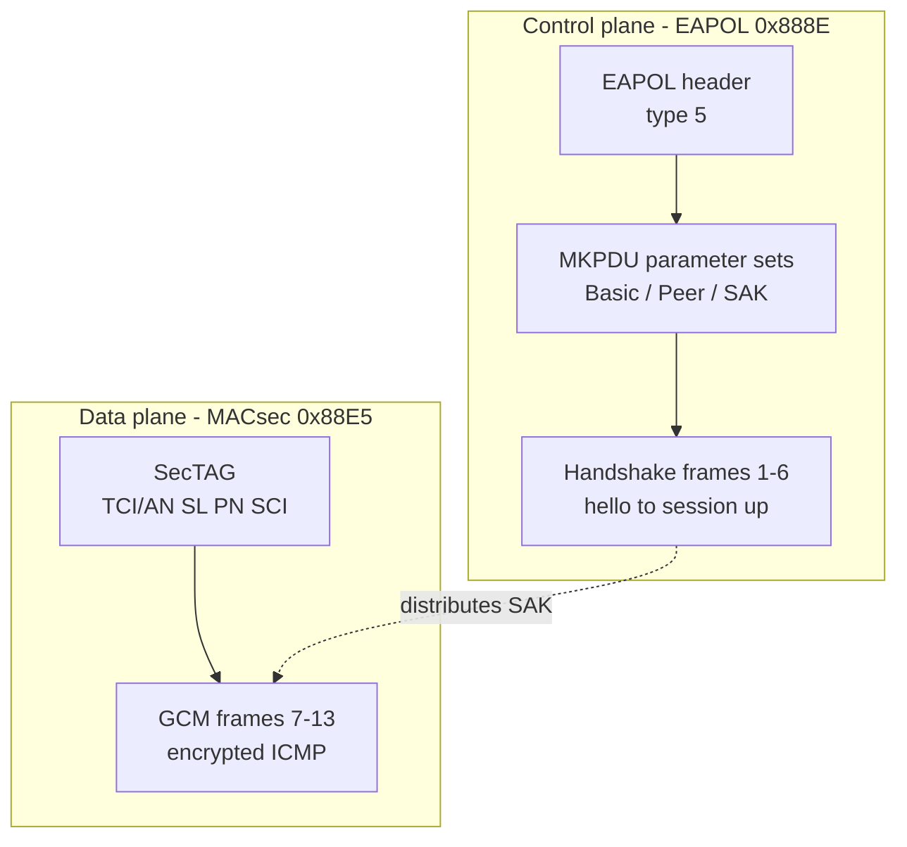

# 第五章 报文字节级解析

前几章把密钥体系和 SecY 模型讲清楚了，但协议的真相最终落在字节上。本章把 [`session-full.pcap`](../captures/session-full.pcap) 的 13 帧逐帧拆开：控制面 6 帧 MKA（hello → 选 Key Server → 分发 SAK → 双方 SAK Use），数据面 7 帧 MACsec（加密的 ICMP 往返，外加一帧省略 SCI 的特殊编码）。每一帧都有偏移级字段表和十六进制转储，可直接对照 Wireshark 逐字节验证。

本章主要内容包括：

- **5.1 EAPOL 头与 SecTAG 比特布局**：两条平面的信封——EAPOL 头与 SecTAG 的每个比特
- **5.2 MKA 参数集逐字节**：Basic / Peer List / Distributed SAK / SAK Use 四类参数集与 ICV
- **5.3 控制面六帧：MKA 握手逐帧解析**：从 hello 到会话建立的完整 6 帧
- **5.4 数据面七帧：MACsec 逐帧解析**：GCM 加密的 ICMP 往返与 ES=1 无 SCI 帧
- **5.5 PSK 与 EAP 鉴权之后的 MKA**：两条鉴权路线在线上的异同
- **5.6 Confidentiality Offset 与 IEEE 向量**：部分加密的权衡，以及与官方向量的逐字节对照

通过本章的学习，读者将能够独立读出任意一帧 MKA 或 MACsec 报文的每个字段，理解字段背后的协议行为，并在 Wireshark 里完成同样的验证。

