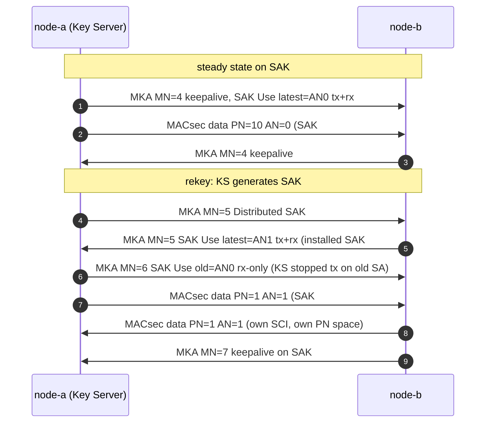

## 6.2 换钥时线上发生什么

知道了"必须换"，接下来看"怎么换"。一次 rekey 的全部线上行为只有 9 帧，抓在 [mka-rekey.pcap](../captures/mka-rekey.pcap)（逐帧解析见[报告 D.08](../captures/decoded/13-mka-rekey.md)）：

图 6-1：mka-rekey.pcap 的 9 帧换钥时序

这场戏里有三个关键角色，认准它们才能看懂后面每一帧：

| 字段 | 在哪里 | 作用 |
|---|---|---|
| **AN**（2 bit，SecTAG TCI） | 数据帧 | 接收方据此选 SA（= 选哪把 SAK）。换钥即 AN 0→1→2→3→0… 轮转 |
| **KN**（Key Number） | Distributed SAK / SAK Use | MKA 里给每把 SAK 的编号，与 KS 的 MI 组成 KI（SA 标识） |
| **SAK Use latest/old** | 每条 MKPDU | 声明"我在用哪个 SA 发、能收哪个 SA"。latest=新 SA，old=上一个 SA |

把时序图和角色表对照，可以提炼出四个要点：

1. **新 SAK 仍是 Key Server 随机生成**，照旧 AES-KeyWrap(KEK) 分发——KEK 不变（CAK 没换），换的只是 SAK。
2. **过渡期双 SA 并存**：A 分发 SAK#2 后，SAK Use 显示 latest=AN1（新）、old=AN0（旧，仍在收发）；等对端确认后才停止用旧 SA 发送（old 变成 rx-only，继续收在途帧），最后 old KN=0 完全退役。
3. **PN 每 SA 独立计数**：AN=1 的第一帧 PN 又从 1 开始，这不是重放——新 SAK = 新的 GCM key，nonce 空间全新。抓包里能看到两帧 `PN=1` 但 AN 不同。
4. **每个方向是独立的 SC/SA**：A→B 与 B→A 各有自己的 SCI、各维护自己的 PN 与重放窗口。

换钥解决的是"发送端钥匙老化"；下一节把视角切到接收端——它凭什么决定一帧该收还是该丢。
