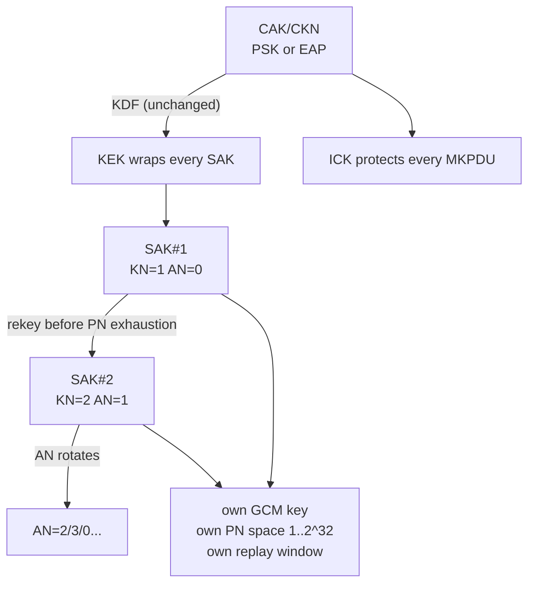

# 第六章 密钥生命周期

SAK 不是配好就一劳永逸的：数据面每一帧都在消耗 PN，密钥也终会走到退役。本章沿着 `mka-rekey.pcap` 的 9 帧抓包，讲清楚三件事——**为什么要换钥、换钥时线上发生什么、旧钥怎么退役**；随后把镜头转到接收端，看 PN 窗口与 Delay Protect 如何拦住"带着旧 PN 卷土重来"的帧。密钥从哪里来，见[第二章](../02_key_hierarchy/README.md)。

本章主要内容包括：

- **6.1 为什么要换钥：PN 会耗尽**：GCM nonce 唯一性如何把 PN 变成消耗品，各线速下的耗尽时钟有多快
- **6.2 换钥时线上发生什么**：AN/KN 轮转、Distributed SAK 二次分发、双 SA 并存到旧钥退役的完整时序
- **6.3 抗重放窗口：四种裁决**：接收端 PN 窗口的判定模型，以及"重放检测不是密码学"的关键认知
- **6.4 Delay Protect：把延迟限死在 MKA 周期内**：用 LLPN 下沿堵住经典窗口对"截留帧"的盲区
- **6.5 保活、判死与数据面存亡**：MKA 保活节奏、6 秒判死，以及控制面消失后 SecY 的两种结局

通过本章的学习，读者将能够读懂一次完整换钥的每一帧报文，理解重放防线"序列策略而非密码学"的本质，并判断一条链路该不该开启 Delay Protect。

