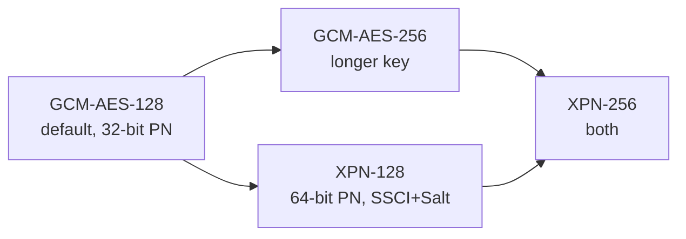

# 第七章 密码套件与 XPN

数据面的加密算法并非只有一种：802.1AE-2018 一共定义了 **4 个**密码套件。它们的数据面格式完全相同（SecTAG、AAD、ICV 长度都不变），区别只有三处——**SAK 长度、nonce（IV）怎么构造、PN 多少位**。理解了这三处差异，四个套件就只剩下一张对照表。

| 套件 | Cipher Suite ID（8 字节） | SAK | PN | 引入 |
|---|---|---|---|---|
| **GCM-AES-128**（默认） | `00-80-C2-00-01-00-00-01` | 128 bit | 32 bit | 802.1AE-2006 |
| **GCM-AES-256** | `00-80-C2-00-01-00-00-02` | 256 bit | 32 bit | 802.1AEbn-2011 |
| **GCM-AES-XPN-128** | `00-80-C2-00-01-00-00-03` | 128 bit | **64 bit** | 802.1AEbw-2013 |
| **GCM-AES-XPN-256** | `00-80-C2-00-01-00-00-04` | 256 bit | **64 bit** | 802.1AEbw-2013 |

ICV 一律 128 bit（GCM tag）。四个套件的 AAD 构造（DA‖SA‖SecTAG‖…，含 confidentiality offset 变体）完全一致，详见[第五章](../05_wire_format/README.md)。

本章主要内容包括：

- **7.1 套件怎么协商**：Algorithm Agility 与 Distributed SAK 里的套件 ID 各管什么
- **7.2 GCM-AES-256：换钥匙不换格式**：只换密钥长度的保守升级及其 IEEE 向量证据
- **7.3 XPN：64 位 PN 与 nonce 重构**：为什么 32 位 PN 会烧完、SSCI/Salt 如何构造 nonce
- **7.4 选择速查**：按场景选套件的一张表

通过本章的学习，读者将能够为给定的速率与合规要求选择正确的套件，并读懂一条 XPN 会话在线上留下的每一处痕迹。

