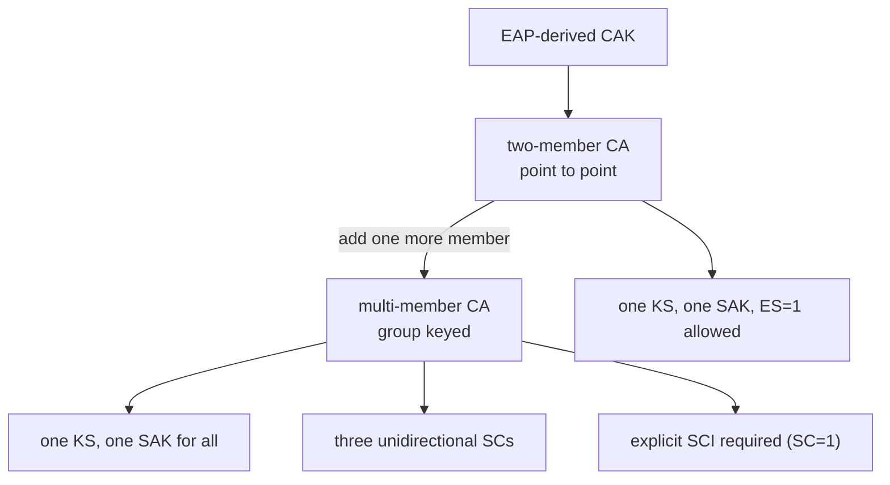

# 第八章 拓扑与多成员 CA

前面章节的故事都发生在两台设备之间——但 CA（Connectivity Association，连通联盟）的本质不是"一对"，而是"一组"。同一个 CAK/CKN 配到几块网卡上，它们就属于同一个联盟，共享同一套密钥体系。本章把视角从点对点拉远：先交代实验抓包模拟的基础拓扑，再看 EAP 鉴权之后角色如何变化，最后进入多成员 CA——那里的一把组密钥、三条独立 SC，正是组密钥安全问题的原型。

本章主要内容包括：

- **8.1 点对点：抓包模拟的逻辑拓扑**：node-a / node-b 的 MAC、SCI、KS 优先级与一条完整故事线
- **8.2 EAP 鉴权成功之后**：Authenticator / Supplicant 角色对拓扑与 Key Server 的影响
- **8.3 多成员 CA 与组密钥**：三成员共享一把 SAK、三条单向 SC 各自 PN 空间的结构

通过本章的学习，读者将能够根据 CA 的成员数判断 SCI 是否必须显式携带、理解"三帧 PN=1 共存却不是重放"的原因，并为第九章的组密钥攻击面讨论建立拓扑直觉。

