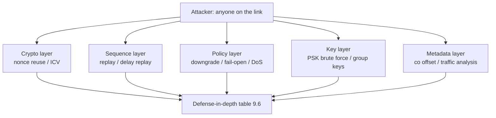

# 第九章 攻击面分析

前八章讲的是协议"设计上防什么"；本章换到攻击者视角，逐条检验这些防线在真实对抗中的成色。每一条攻击面都按同一套三段式展开：**原理 → 实验室证据（可复现的抓包/测试）→ 真实部署的缓解**——先给结论，再逐条展开。本章是学习笔记，不是渗透指南。

本章主要内容包括：

- **9.1 威胁模型与安全目标**：MACsec 假设的对手是谁，802.1AE 明确提供与不提供的东西
- **9.2 GCM nonce 复用：最致命的威胁**：PN 复用如何击穿 GCM，以及整个生命周期管理为何为它而设
- **9.3 经典重放与延迟重放**：原样重发的帧靠窗口拦，被截留的帧靠 Delay Protect
- **9.4 明文降级、配置错误与控制面 DoS**：攻击不在密码学，而在策略回退与控制面可用性
- **9.5 PSK 弱口令与组密钥的固有问题**：离线暴力 CAK 的环境，以及成员互相不可区分的结构性限制
- **9.6 明文泄露面、流量分析与防线分层**：co 偏移、捕获点误差、元数据可见性，最后汇总成分层防线表

通过本章的学习，读者将能够准确说出 MACsec 的能力边界——它防什么、不防什么、每条防线被绕过时的后果，从而在评估与部署时做出有依据的决策。

