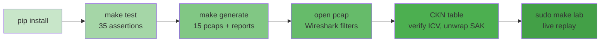

# 第十章 动手实验室

前九章在纸面上讲清楚了 MACsec 与 MKA：密钥如何派生、报文长什么样、生命周期如何流转。本章把书变成实验台——35 项密码学与协议测试、15 个 Wireshark 可直接打开的参考抓包、一个能把参考帧打到虚拟线上的 live 实验。这里的一切论断都不需要你"相信叙述"：命令会替你验证。

本章主要内容包括：

- **10.1 快速开始：test / generate / verify**：三条 make 命令跑通测试、生成抓包、完成验证
- **10.2 十五个参考抓包导读**：每份 pcap 对应哪一章的故事线
- **10.3 Wireshark：验 ICV、解 SAK**：过滤器速查与 CKN 表配置
- **10.4 Live 实验：netns 与 veth**：把参考帧打到虚拟线上再抓回来
- **10.5 排障指南**：六种常见故障的对症处理

通过本章的学习，读者将能够独立运行整个实验室，并在 Wireshark 里亲手验证正文中出现过的每一个字段、每一把密钥与每一条时序。

