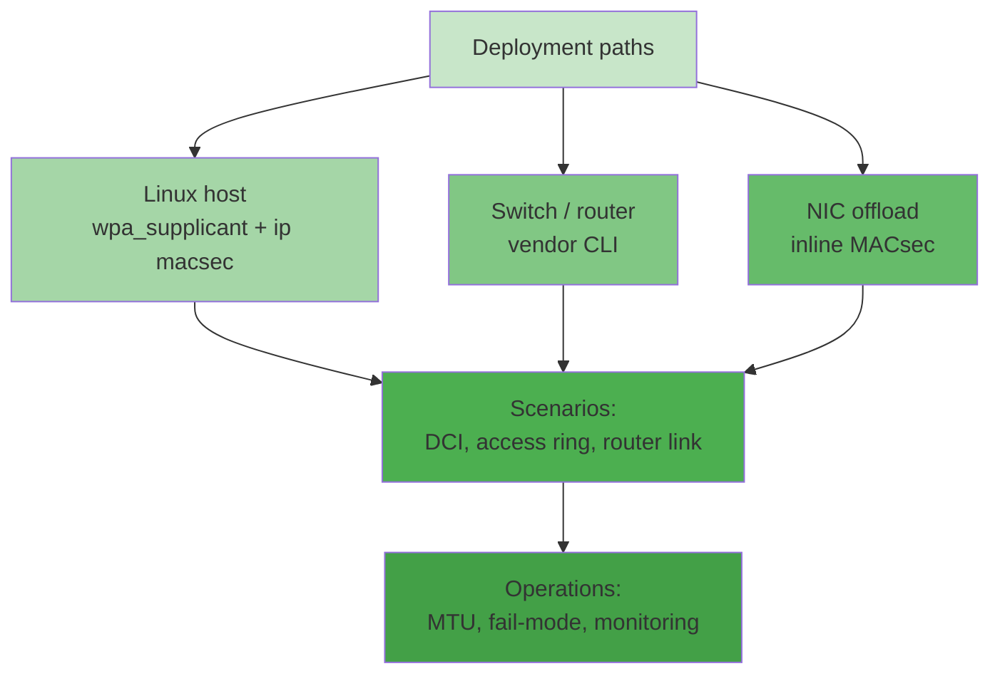

# 第十一章 真实世界部署

实验室教你协议长什么样；本章教你**生产上怎么落地**。Linux 主机、商业交换机、智能网卡各有各的 MACsec 形态，工程约束——性能、MTU、密钥轮换、故障模式——也从这里开始登场。全部内容基于公开文档可验证；厂商 CLI 只给"形状"，逐字语法以各家配置指南为准。

本章主要内容包括：

- **11.1 Linux 全栈：wpa_supplicant 与 ip macsec**：内核 SecY + wpa_supplicant KaY，PSK 最小配置与手工 SecY
- **11.2 交换机与商业实现**：主流厂商路线与 PSK 配置的共同形状
- **11.3 网卡卸载**：哪些硬件能线速跑 MACsec，怎么判断
- **11.4 典型部署场景**：交换机互联、数据中心、路由器互联、企业有线端口
- **11.5 运维清单**：八个高频踩坑点与监控要点

通过本章的学习，读者将能够把第十章实验室里的概念——CAK/CKN、Key Server 优先级、重放窗口、fail 模式——逐一映射到真实设备配置项上。

