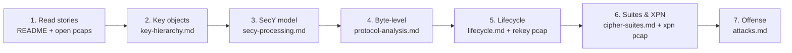
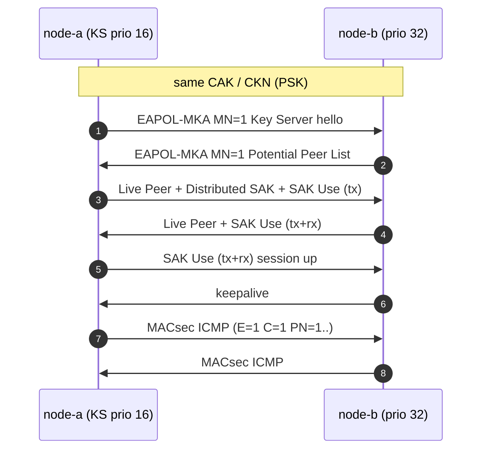

# MACsec Lab — IEEE 802.1AE / 802.1X MKA 知识库

**License**: [MIT](#license) · 纯 Python，无需内核 MACsec · 15 个 Wireshark 可开抓包 · 35 项密码学/协议测试

一个把 MACsec 相关知识汇聚到一起的**专业知识库 + 可验证实验室**：参考抓包、按字段解析的报文、与 IEEE 官方向量逐字节对齐的密码学实现（GCM-AES / AES-CMAC / AES-KeyWrap，ICV 可验、SAK 可解），外加覆盖协议、密钥、攻防、部署、对比的成体系文档。姊妹仓库：[IPsec_Lab](https://github.com/johnfu-ai/IPsec_Lab) / [IEEE_802.1X_Lab](https://github.com/johnfu-ai/IEEE_802.1X_Lab)。

本机 WSL2 内核 **未开启** `CONFIG_MACSEC`，因此数据面抓包不是 `ip macsec` 内核卸载出来的，而是按 802.1AE 组出来、密码学与 [IEEE GCM 测试向量](https://ieee802.org/1/files/public/docs2011/bn-randall-test-vectors-0511-v1.pdf) 对齐的帧。MKA 走真实 EAPOL（EtherType `0x888E`，Packet Type **5**），Wireshark 的 `mka` 解析器可以直接展开。

> **仅供学习。** 仓库里的 CAK/SAK 是演示密钥，一克隆就当已经泄露。不要用在任何真实网络上。

## 目录

- [学习路径](#学习路径)
- [知识地图](#知识地图)
- [能看到什么](#能看到什么)
- [快速开始](#快速开始)
- [抓包对照](#抓包对照)
- [协议与密钥](#协议与密钥)
- [目录结构](#目录结构)
- [Wireshark](#wireshark)
- [Live 实验（可选）](#live-实验可选)
- [免责声明](#免责声明)

## 学习路径



| 阶段 | 读物 | 抓包 | 你将获得 |
|---|---|---|---|
| **入门**（半天） | 本 README → [key-hierarchy.md](docs/key-hierarchy.md) → [glossary.md](docs/glossary.md) | `session-full.pcap` | 五个密钥对象（CAK/CKN/KEK/ICK/SAK）是谁、一条会话长什么样 |
| **进阶**（1-2 天） | [secy-processing.md](docs/secy-processing.md) → [protocol-analysis.md](docs/protocol-analysis.md) → [lifecycle.md](docs/lifecycle.md) | `mka-rekey.pcap` `macsec-replay.pcap` `mka-delay-protect.pcap` | SecY 收发模型、换钥、重放窗口、延迟保护 |
| **深入**（2-3 天） | [cipher-suites.md](docs/cipher-suites.md) → [mka-reference.md](docs/mka-reference.md) → [attacks.md](docs/attacks.md) | `mka-xpn.pcap` `mka-multi-peer.pcap` `mka-co30.pcap` | 四套件/XPN、MKA 全字段、攻防视角 |
| **扩展**（按需） | [deployments.md](docs/deployments.md) / [vs-ipsec.md](docs/vs-ipsec.md) / [faq.md](docs/faq.md) / [standards-map.md](docs/standards-map.md) | IEEE 向量 pcap | 生产落地、与 IPsec/TLS/WG 对比、标准演进 |

配套动手：`make test` 里改任何一个常量（密钥/PN/AAD）看哪条断言先挂——挂掉的顺序就是概念重要性的顺序。

## 知识地图

| 知识域 | 文档 | 演示抓包 |
|---|---|---|
| 密钥体系（CAK→KEK/ICK→SAK，PSK vs EAP） | [key-hierarchy.md](docs/key-hierarchy.md) | `mka-handshake.pcap` `mka-after-eap.pcap` |
| SecY 数据面（收发模型、校验策略、计数器） | [secy-processing.md](docs/secy-processing.md) | `macsec-lab-*.pcap` |
| 逐帧字节级解析 | [protocol-analysis.md](docs/protocol-analysis.md) | `session-full.pcap` |
| MKA 参考手册（标识符/选举/参数集） | [mka-reference.md](docs/mka-reference.md) | 全部 `mka-*.pcap` |
| 生命周期（换钥、PN 耗尽、判死） | [lifecycle.md](docs/lifecycle.md) | `mka-rekey.pcap` |
| 抗重放（窗口四裁决） | [lifecycle.md](docs/lifecycle.md) §3.1 | `macsec-replay.pcap` |
| 延迟保护（LPN 下沿） | [lifecycle.md](docs/lifecycle.md) §3.2 | `mka-delay-protect.pcap` |
| 密码套件（128/256/XPN、nonce 构造） | [cipher-suites.md](docs/cipher-suites.md) | `mka-xpn.pcap` + IEEE 向量 pcap |
| 机密性偏移（co 30/50） | [macsec-protocol-analysis.md](docs/macsec-protocol-analysis.md) §4b | `mka-co30.pcap` |
| 多成员 CA（组密钥） | [topology.md](docs/topology.md) | `mka-multi-peer.pcap` |
| 攻击面与缓解 | [attacks.md](docs/attacks.md) | （交叉引用各 pcap） |
| 真实部署（Linux/交换机/NIC/运维） | [deployments.md](docs/deployments.md) | — |
| 与 IPsec/TLS/WireGuard 对比 | [vs-ipsec.md](docs/vs-ipsec.md) | — |
| 标准演进（2006-2026 时间线） | [standards-map.md](docs/standards-map.md) | — |
| FAQ | [faq.md](docs/faq.md) | — |
| 术语库（80+ 中英对照） | [glossary.md](docs/glossary.md) | — |

## 能看到什么

| 平面  | 协议               | 抓包里有什么                                                                                              |
| --- | ---------------- | --------------------------------------------------------------------------------------------------- |
| 控制面 | **MKA**（KaY）     | Key Server 选举、CKN、Live/Potential Peer List、KEK 封装的 **Distributed SAK**、**SAK Use**、AES-CMAC **ICV** |
| 数据面 | **MACsec**（SecY） | EtherType `0x88E5`、SecTAG（TCI/AN/SL/PN/SCI）、Secure Data、GCM **ICV**                                 |
| 对照  | IEEE 官方向量        | 公开的 GCM-AES-128/256 完整性 / 机密性测试帧，本仓库测试会逐字节比对 ICV                                                        |

PSK CAK（`session-full.pcap`）：两端事先配好同一把 CAK/CKN，MKA 直接开始。



EAP 鉴权成功之后（`mka-after-eap.pcap`）：MKPDU 参数集与上面相同，但 CAK/CKN 来自 EAP **MSK**，Authenticator 当 Key Server。EAP-TLS 本身在 [IEEE_802.1X_Lab](https://github.com/johnfu-ai/IEEE_802.1X_Lab)；本抓包从 **EAP-Success** 起。

```mermaid
sequenceDiagram
    autonumber
    participant Auth as Authenticator (KS prio 0)
    participant Supp as Supplicant (prio 255)
    Note over Auth,Supp: EAP-TLS done (IEEE_802.1X_Lab); MSK on both sides
    Auth->>Supp: EAP-Success
    Note over Auth,Supp: CAK = KDF(MSK[0:16], IEEE8021 EAP CAK, mac1||mac2)
    Auth->>Supp: EAPOL-MKA MN=1 Key Server hello
    Supp->>Auth: EAPOL-MKA MN=1 Potential Peer List
    Auth->>Supp: Live Peer + Distributed SAK + SAK Use (tx)
    Supp->>Auth: Live Peer + SAK Use (tx+rx)
    Auth->>Supp: SAK Use (tx+rx) session up
    Supp->>Auth: keepalive
```

## 快速开始

```bash
cd ~/MACsec_Lab
python3 -m pip install -r requirements.txt   # cryptography

make test        # IEEE 向量 + 往返加解密 / ICV / SAK unwrap（35 项）
make generate    # 写出 captures/*.pcap 和 captures/decoded/*.md
make verify      # 测试 + tshark 能否认出 mka / macsec（15 项）
```

然后打开 `captures/session-full.pcap`，过滤 `mka || macsec`。

字段级解析（本仓库自己的解析器，不依赖 Wireshark 密钥表），每份报告都是总览表 + 逐字段偏移表 + 十六进制：

- [captures/decoded/01-mka-handshake.md](captures/decoded/01-mka-handshake.md) — PSK 握手 6 帧
- [captures/decoded/02-macsec-encrypted.md](captures/decoded/02-macsec-encrypted.md) / [03-macsec-integrity-only.md](captures/decoded/03-macsec-integrity-only.md) — 同一 ICMP 的两种保护模式
- [captures/decoded/11-mka-after-eap.md](captures/decoded/11-mka-after-eap.md) — EAP-Success 之后的 MKA
- [captures/decoded/13-mka-rekey.md](captures/decoded/13-mka-rekey.md) — SAK 重加密全过程（AN=0 → AN=1 → 旧钥退役）
- [captures/decoded/14-mka-co30.md](captures/decoded/14-mka-co30.md) — confidentiality offset 30：前 30 字节只认证不加密
- [captures/decoded/15-ieee-integrity-256.md](captures/decoded/15-ieee-integrity-256.md) / [16-ieee-encrypt-256.md](captures/decoded/16-ieee-encrypt-256.md) — IEEE GCM-AES-256 官方向量
- [captures/decoded/17-mka-xpn.md](captures/decoded/17-mka-xpn.md) — XPN：套件 ID 进 Distributed SAK，PN64 越过 2³²、线上 PN 回绕而不换钥
- [captures/decoded/18-mka-multi-peer.md](captures/decoded/18-mka-multi-peer.md) — 多成员 CA：3 节点共享 CAK、一个 KS 分发一把 SAK、三个 SC 各自 PN
- [captures/decoded/19-macsec-replay.md](captures/decoded/19-macsec-replay.md) — 接收端重放窗口：乱序接受、原样重放帧被丢弃（ICV 依然有效）
- [captures/decoded/20-mka-delay-protect.md](captures/decoded/20-mka-delay-protect.md) — Delay Protect：SAK Use 宣告 LLPN 下沿，被截留的帧延迟重放必弃

## 抓包对照

| 文件                                        | 用途                                         |
| ----------------------------------------- | ------------------------------------------ |
| `captures/mka-handshake.pcap`             | 6 帧 MKA（PSK CAK）：hello → 选 KS → 分发 SAK → 双方 SAK Use |
| `captures/mka-after-eap.pcap`             | EAP-Success 之后：Authenticator 为 KS，CAK 从 MSK 派生     |
| `captures/mka-rekey.pcap`                 | SAK 重加密：AN=0 → AN=1，双 SA 并存 → 旧钥退役（[lifecycle.md](docs/lifecycle.md)） |
| `captures/mka-co30.pcap`                  | Confidentiality offset 30：内层 EtherType+IP+8 字节明文可见，只认证不加密 |
| `captures/mka-xpn.pcap`                   | XPN 套件：Distributed SAK 带 8 字节套件 ID、SSCI/Salt nonce、PN64 越过 2³² 不换钥（[cipher-suites.md](docs/cipher-suites.md)） |
| `captures/mka-multi-peer.pcap`            | 多成员 CA：3 节点共享一把 CAK，KS 分发**一把** SAK 给全体，三个方向各自 SC/SCI（[topology.md](docs/topology.md)） |
| `captures/macsec-replay.pcap`             | 接收端重放窗口四种裁决：按序 / 窗口内乱序接受、低于下沿 / 重复丢弃；重放帧 ICV 依然校验通过（[lifecycle.md](docs/lifecycle.md) §3.1） |
| `captures/mka-delay-protect.pcap`         | Delay Protect：被截留的帧在 SAK Use 宣告 LLPN 下沿后重放必弃——经典窗口会接受的盲区（[lifecycle.md](docs/lifecycle.md) §3.2） |
| `captures/macsec-lab-encrypted.pcap`      | 实验室 GCM-AES-128，载荷加密                       |
| `captures/macsec-lab-integrity-only.pcap` | 同一 ICMP，`E=0 C=0`，内层 IPv4 明文可见             |
| `captures/macsec-ieee-gcm-aes-128-*.pcap` | IEEE 公开的 GCM 测试向量（128-bit key）               |
| `captures/macsec-ieee-gcm-aes-256-*.pcap` | 同一帧换 256-bit key 的 IEEE 向量（Randall §2.1.2/§2.2.2） |
| `captures/session-full.pcap`              | PSK MKA + 加密数据面，一条故事线                      |
| `captures/keys.json`                      | 演示 PSK CAK 与 EAP 派生 CAK / CKN / SAK（含各故事线 SAK）/ KEK / ICK |

## 协议与密钥

CAK **从不**直接加密用户帧。PSK 预共享的是 CAK+CKN，不是 SAK。KEK/ICK 从 CAK 派生；SAK 由 Key Server **另生成**，用 AES-KeyWrap(KEK) 放进 MKPDU：

```
PSK 配置 或  EAP MSK
 ├── CAK   根密钥（只派生 KEK/ICK）
 └── CKN   名字（不是密钥；KDF 的 context）

CAK + CKN
 ├── KEK = KDF(..., "IEEE8021 KEK")  → AES-KW 封装 SAK
 └── ICK = KDF(..., "IEEE8021 ICK")  → MKPDU ICV

Key Server 随机生成 SAK  →  AES-KW(KEK, SAK) 经 MKA 分发  →  SecY GCM
```

层次图、五个对象对照表、KDF 公式：[docs/key-hierarchy.md](docs/key-hierarchy.md)。

- **EAPOL-MKA Packet Type = 5**（IEEE 802.1X Table 11-3 `0000 0101`）。Type 6 是 EAPOL-Announcement，不是 MKA。
- EAP 成功之后：`CAK = KDF(MSK[0:16], "IEEE8021 EAP CAK", mac1||mac2)`，CKN 同理用 `"IEEE8021 EAP CKN"`（label 16 字节，与 KEK/ICK 的 12 字节不同）。
- MACsec ICV：GCM 的 16 字节 tag。IV = SCI(8) ‖ PN(4)。AAD 含 DA‖SA‖SecTAG（含 `0x88E5`）；完整性模式还要把 User Data 放进 AAD。
- MKA ICV：`AES-CMAC(ICK, DA‖SA‖0x888E‖EAPOL−ICV)`（802.1X 9.4.1）。

文档总览：

- [docs/key-hierarchy.md](docs/key-hierarchy.md) — CAK / CKN / KEK / ICK / SAK 是什么、怎么生成
- [docs/secy-processing.md](docs/secy-processing.md) — SecY 收发处理模型：受控/非受控口、发送六步、接收五道关、validate-frames 策略
- [docs/mka-reference.md](docs/mka-reference.md) — MKA 参考手册：标识符（MI/MN/SCI/KI/KN）、KS 选举、对等体状态、全部参数集逐字段表
- [docs/lifecycle.md](docs/lifecycle.md) — 换钥（rekey）、AN/KN、PN 耗尽、重放窗口、Delay Protect、判死
- [docs/cipher-suites.md](docs/cipher-suites.md) — GCM-AES-128/256/XPN 四套件对照、协商、XPN nonce 构造
- [docs/protocol-analysis.md](docs/protocol-analysis.md) — **每一条消息的偏移级解析**（session-full）
- [docs/mka-protocol-analysis.md](docs/mka-protocol-analysis.md) — 含 PSK vs EAP 成功之后
- [docs/macsec-protocol-analysis.md](docs/macsec-protocol-analysis.md)
- [docs/attacks.md](docs/attacks.md) — 攻击面分析：nonce 复用/重放/延迟重放/降级/离线暴力/组密钥局限，每条带实验室证据
- [docs/deployments.md](docs/deployments.md) — 真实世界：Linux wpa_supplicant/ip macsec、厂商、NIC 卸载、运维清单
- [docs/vs-ipsec.md](docs/vs-ipsec.md) — 四层加密协议对比：MACsec vs IPsec vs TLS vs WireGuard + 选型与叠加
- [docs/faq.md](docs/faq.md) — 36 问 FAQ：概念/密钥/抓包/运维/选型，每条答案带出处
- [docs/glossary.md](docs/glossary.md) — 中英对照术语库：按协议/密钥/通道/帧字段/机制/XPN/生态分组的 80+ 术语
- [docs/standards-map.md](docs/standards-map.md) — 标准演进时间线（2006-2026）与条款级对照
- [docs/topology.md](docs/topology.md) · [docs/capture-guide.md](docs/capture-guide.md) · [docs/troubleshooting.md](docs/troubleshooting.md) · [docs/spec.md](docs/spec.md)

## 目录结构

```
MACsec_Lab/
├── README.md
├── Makefile
├── macsec_lab/          # 组包 / 解包 / 派生密钥 / 接收端模型
├── tests/               # IEEE 向量必须通过（35 项）
├── captures/            # 15 个参考 pcap + keys.json + decoded/（15 份字段级报告 + tshark 树）
├── docs/                # 18 篇知识库文档
├── examples/c/          # SecTAG 比特布局（教学子集）
└── scripts/             # generate / verify / live netns
```

## Wireshark

```
mka || macsec
eapol.type == 5
eap.code == 3
eth.type == 0x88e5
macsec.sl || macsec.an
mka.param_set_type == 4     # Distributed SAK
mka.delay_protect == 1      # delay protect stories
```

让 Wireshark 自己验 MKA ICV、解开 SAK：Preferences → Protocols → **MKA** → CKN 表，填 `keys.json` 里的 CKN 与 CAK。

Windows 下打开 WSL 文件：

```
\\wsl$\<发行版>\home\<用户>\MACsec_Lab\captures\session-full.pcap
```

## Live 实验（可选）

不需要内核 MACsec 模块。两个 netns + veth + 网桥，用 AF_PACKET 把参考帧打到线上，tcpdump 抓一份 `captures/live-session.pcap`：

```bash
sudo make lab
sudo make down
```

Linux 网桥默认丢掉 PAE 组播 `01:80:c2:00:00:03`。脚本会把 `group_fwd_mask` 写成 `8`（与 802.1X Lab 相同）。若抓不到 MKA，见 [docs/troubleshooting.md](docs/troubleshooting.md)。

若内核打开了 `CONFIG_MACSEC`，可以用 `ip macsec` 做真实 SecY；本仓库的解析器同样能读那种 pcap（需要你提供 SAK）。

## 免责声明

本项目只用于理解 IEEE 802.1AE / 802.1X MKA 的帧格式与密钥关系。

- 不要把这里的密钥、镜像或脚本部署到生产或你没有明确授权的网络。
- `keys.json` 与代码里的 CAK/SAK 是 **演示材料**。
- 作者不对误用承担责任。

## License

MIT。IEEE 标准文本本身不在本仓库；实现按公开条款（802.1X 9.x / 11.x 图、802.1AE Clause 9/14、Randall GCM 测试向量）编写。
