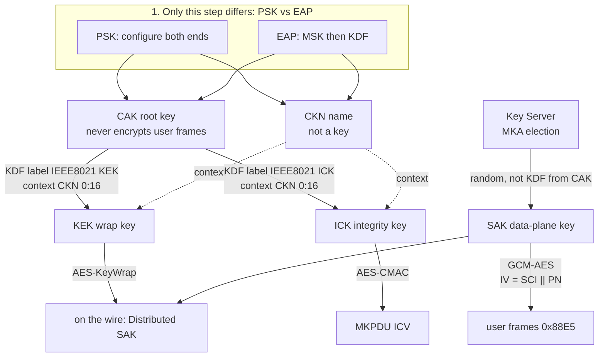

# 密钥层次：CAK / CKN / KEK / ICK / SAK

PSK 预共享的是 **CAK + CKN**，不是 SAK。CAK **从不**加密用户帧。KEK / ICK 由两端各自用同一套 KDF 算出来；SAK 由 Key Server **另生成**一把，再用 KEK 封装后经 MKA 分发。

PSK 与 EAP 只在「CAK/CKN 从哪来」这一步不同；之后的 MKA（选 KS、Distributed SAK、SAK Use）相同。

代码：`macsec_lab/crypto.py`（`derive_kek` / `derive_ick` / `derive_eap_cak` / `derive_eap_ckn` / `wrap_sak`）。演示值：`captures/keys.json`（公开，勿用于真实链路）。

## 生成关系



最容易记错的一点：**SAK 不是 `KDF(CAK, …)`。** 线上出现的是 `AES-KeyWrap(KEK, SAK)`，不是 SAK 明文。

## 五个对象

| 对象 | 是什么 | 怎么来 | 干什么 |
|---|---|---|---|
| **CKN** | CAK 的名字，不是密钥 | PSK：配置（本实验室 ASCII `MACSEC-LAB-CKN01`）。EAP：`KDF(MSK[0:N], "IEEE8021 EAP CKN", Session-ID\|\|mac1\|\|mac2, 128)` | MKPDU Basic；KDF 的 16 字节 context |
| **CAK** | 连通联盟根密钥 | PSK：预共享。EAP：`KDF(MSK[0:N], "IEEE8021 EAP CAK", mac1\|\|mac2, N×8)` | **只**派生 KEK / ICK |
| **KEK** | 封装 SAK 的钥匙 | `KDF(CAK, "IEEE8021 KEK", CKN[0:16], 128)`，两端各自算 | `AES-KeyWrap` → Distributed SAK |
| **ICK** | MKPDU 完整性钥匙 | `KDF(CAK, "IEEE8021 ICK", CKN[0:16], 128)`，两端各自算 | `AES-CMAC` → MKA ICV |
| **SAK** | 用户帧 GCM 钥匙 | Key Server **随机生成**（不是从 CAK 算），经 MKA 分发 | SecY 保护数据面；换钥再发一把 |

PSK 抓包：`captures/mka-handshake.pcap`。EAP 成功之后：`captures/mka-after-eap.pcap`（从 EAP-Success 起；完整 EAP-TLS 在 [IEEE_802.1X_Lab](https://github.com/johnfu-ai/IEEE_802.1X_Lab)）。

## KDF 公式（IEEE 802.1X 6.2.1 / 6.2.2）

PRF = AES-CMAC，NIST SP 800-108 计数器模式。

KEK / ICK 的 label **恰好 12** ASCII 字节（含空格）。EAP 派生 CAK / CKN 的 label 是 **16** 字节。

```
KEK = KDF(CAK, "IEEE8021 KEK", CKN[0:16], 128)
ICK = KDF(CAK, "IEEE8021 ICK", CKN[0:16], 128)
```

EAP 路径（本实验室未跑完整 EAP-TLS，只从 MSK 起算）：

```
CAK = KDF(MSK[0:cak_len], "IEEE8021 EAP CAK", mac1||mac2, CAKlength)
CKN = KDF(MSK[0:cak_len], "IEEE8021 EAP CKN", Session-ID||mac1||mac2, 128)
```

`mac1` 是数值较小的 MAC，`mac2` 是较大的（802.1X 6.2.2）。

持有相同 CAK+CKN 的成员不必交换 KEK/ICK。SAK 相反：只有 Key Server 生成，对端 unwrap 后交给 SecY。

实验室为可复现抓包，PSK / EAP 两条故事线各固定了一把演示 SAK；真实实现里 SAK 每次由 KS 随机产生。

## 两条平面

| 平面 | 协议 | 用哪些钥匙 |
|---|---|---|
| 控制面 KaY | MKA，EAPOL type **5**，EtherType `0x888E` | CKN 出现在 Basic；ICK 保护 MKPDU；KEK 封装 SAK |
| 数据面 SecY | MACsec，EtherType `0x88E5` | **只用 SAK**。CAK / CKN / KEK / ICK 都不进入 GCM |

MKA ICV：`AES-CMAC(ICK, DA‖SA‖0x888E‖EAPOL−ICV)`（802.1X 9.4.1）。

MACsec：IV = SCI(8) ‖ PN(4)。AAD 含 DA‖SA‖SecTAG（含 `0x88E5`）。

报文格式见 [mka-protocol-analysis.md](mka-protocol-analysis.md)、[macsec-protocol-analysis.md](macsec-protocol-analysis.md)。
