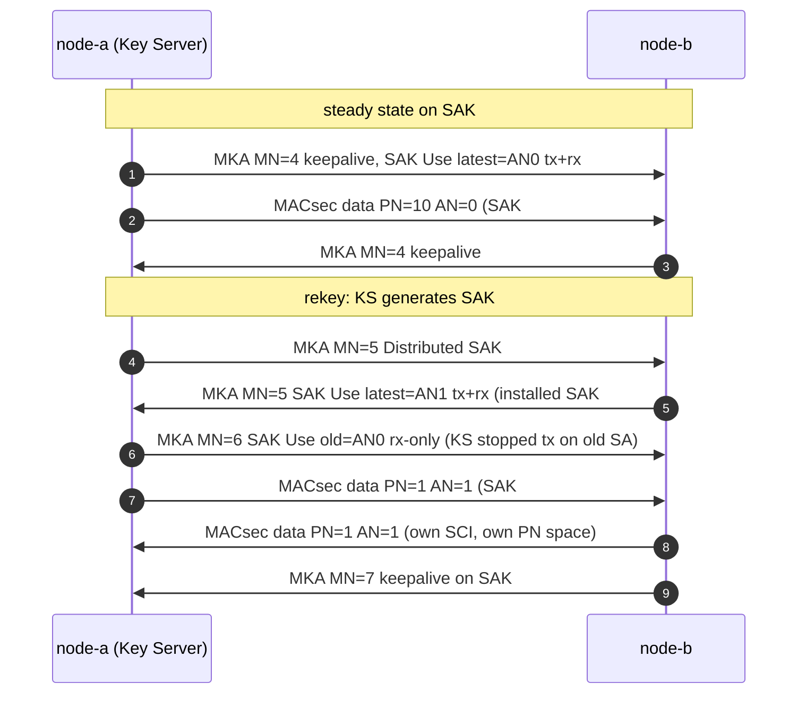

# 密钥生命周期：从建立、换钥到退役

SAK 不是配好就一劳永逸的。本文按 `captures/mka-rekey.pcap`（逐帧解析：[captures/decoded/13-mka-rekey.md](../captures/decoded/13-mka-rekey.md)）讲清楚三件事：**为什么要换钥、换钥时线上发生什么、旧钥怎么退役**。密钥从哪来见 [key-hierarchy.md](key-hierarchy.md)。

## 1. 为什么要换钥：PN 会耗尽

GCM 的 nonce = SAK ‖ (SCI ‖ PN)。同一把 SAK 上 **PN 不得重复**，否则 nonce 复用直接击穿 GCM（攻击者可恢复认证密钥）。PN 只有 32 bit：

| 线速（64 B 小帧） | 包速率 | 2³² 个 PN 用完只要 |
|---|---|---|
| 1 Gbps | ~1.49 Mpps | ≈ 48 分钟 |
| 10 Gbps | ~14.88 Mpps | ≈ 4.8 分钟 |
| 100 Gbps | ~148.8 Mpps | ≈ 29 秒 |
| 400 Gbps | ~595 Mpps | ≈ 7 秒 |

所以 Key Server 必须在 PN 接近 2³² **之前**分发新 SAK。除此之外，出于密钥新鲜度策略（如定期强制换钥）也会触发 rekey。32-bit PN 不够用的场景正是 XPN 套件（64-bit PN）的动机，见 [cipher-suites.md](cipher-suites.md)；PN 越过 2³²、线上 PN 回绕而**不换钥**的样子，抓在 `captures/mka-xpn.pcap`（报告 [17](../captures/decoded/17-mka-xpn.md)）。

## 2. 换钥时线上发生什么（`mka-rekey.pcap` 9 帧）



关键角色：

| 字段 | 在哪里 | 作用 |
|---|---|---|
| **AN**（2 bit，SecTAG TCI） | 数据帧 | 接收方据此选 SA（= 选哪把 SAK）。换钥即 AN 0→1→2→3→0… 轮转 |
| **KN**（Key Number） | Distributed SAK / SAK Use | MKA 里给每把 SAK 的编号，与 KS 的 MI 组成 KI（SA 标识） |
| **SAK Use latest/old** | 每条 MKPDU | 声明"我在用哪个 SA 发、能收哪个 SA"。latest=新 SA，old=上一个 SA |

要点：

1. **新 SAK 仍是 Key Server 随机生成**，照旧 AES-KeyWrap(KEK) 分发——KEK 不变（CAK 没换），换的只是 SAK。
2. **过渡期双 SA 并存**：A 分发 SAK#2 后，SAK Use 显示 latest=AN1（新）、old=AN0（旧，仍在收发）；等对端确认后才停止用旧 SA 发送（old 变成 rx-only，继续收在途帧），最后 old KN=0 完全退役。
3. **PN 每个SA独立计数**：AN=1 的第一帧 PN 又从 1 开始，这不是重放——新 SAK = 新的 GCM key，nonce 空间全新。抓包里能看到两帧 `PN=1` 但 AN 不同。
4. **每个方向是独立的 SC/SA**：A→B 与 B→A 各有自己的 SCI、各维护自己的 PN 与重放窗口。

## 3. 抗重放与 Delay Protect

- **重放窗口**：接收方维护每个 SA 的 PN 窗口（低于窗口下沿的帧丢弃）。换钥后新 SA 窗口重新开张。
- **SAK Use 里的 LPN（lowest PN）**：双方在 SAK Use 中交换各自仍可接受的最低 PN（Latest/Old lowest PN），配合 **Delay Protect** 使用，详见下面 §3.2。实验室所有 SAK Use 均 `delay_protect=1`，逐字段见 13-mka-rekey.md 的 `Latest lowest PN` 行。

### 3.1 窗口怎么判：四种裁决（`macsec-replay.pcap`）

接收方对每个 SA 记两个量：`next`（比已按序收到的最大 PN 大 1）和窗口宽度 `W`（可容忍的乱序量，`W=0` 即严格模式：完全不许乱序）。对到达帧的 PN 逐一裁决（模型实现 `macsec_lab.macsec.ReplayWindow`，逐帧抓包 `captures/macsec-replay.pcap` / [报告 19](../captures/decoded/19-macsec-replay.md)）：

| 到达 PN | 裁决 | 依据 |
|---|---|---|
| `PN >= next` | **接受（in order）**，`next` 前移、窗口滑动 | 最新帧 |
| `next-1-W < PN < next` 且未见过 | **接受（reordered）** | 窗口内的合法乱序 |
| `PN <= next-1-W` | **丢弃（stale）** | 低于窗口下沿——重放帧最终都落在这里 |
| 窗口内但已收到过 | **丢弃（duplicate）** | 原样重发/复制的帧 |

抓包里 9 帧把四种裁决全部演示了一遍：PN 1→2→3 按序；PN=5 先到（4 缺失）窗口滑过；PN=4 迟到但在窗口内被接受；随后 **PN=3 原样重放——ICV 依然校验通过**（同一 PN = 同一 GCM nonce = 同一密文同一 tag，字节级完全相同），只有 PN 窗口能拦住它；PN=6 重复帧同样被"已见过"判掉。

> 关键认知：**重放检测不是密码学**。重放帧是合法帧的逐字节拷贝，GCM/ICV 层面毫无破绽；防线完全在接收端的 PN 序列策略上。这也是为什么 `W` 不能开太大——窗口越大，重放帧能存活的时间越长。

### 3.2 Delay Protect：把重放延迟限死在 MKA 周期内（`mka-delay-protect.pcap`）

§3.1 的窗口有个盲区：**被截留的帧**。假设攻击者拦下 PN=1 不放行，B 只收到 PN=2、3——对 B 来说 PN=1 "没见过、又在窗口里"，攻击者任何时候放出这帧，经典窗口都会**接受**它。窗口宽度只约束"已见过的最老帧"，不约束"多久之前的帧还能第一次到达"。

Delay Protect 补上这个洞（MKA 层机制，不是新的密码学）：

1. 每隔一个 MKA 周期（默认 **2 s**），接收方在 SAK Use 里宣告自己**仍可接受的最低 PN**（Latest lowest PN，LLPN；换钥过渡期还有 Old lowest PN，OLPN，用于旧钥排空）。
2. 宣告之后，接收方 SecY 拒收 **PN < LLPN** 的帧——无论经典窗口怎么说。
3. 效果：一帧被延迟超过约一个 MKA 周期就必然作废。攻击者的"存货"每 2 秒清零一次。

抓包故事（`captures/mka-delay-protect.pcap`，逐帧 [报告 20](../captures/decoded/20-mka-delay-protect.md)）：前 6 帧是标准握手；A 发 PN=1/2/3，其中 **PN=1 被在路径攻击者截留**（B 没收到）；B 的 keepalive 在 SAK Use 里宣告 `delay_protect=1, LLPN=3`；攻击者随后释放 PN=1——字节级合法、ICV 通过、在 32 深窗口内且从未见过，**经典窗口必收**，但 `1 < 3` 落在 LPN 下沿之下，**丢弃**。

| | 经典重放窗口（§3.1） | + Delay Protect（本节） |
|---|---|---|
| 拦下的帧延迟重放 | **接受**（未见过、在窗口内） | **丢弃**（< LLPN） |
| 重放延迟上界 | 无（窗口只随流量滑动） | ≈ 一个 MKA 周期（2 s） |
| 代价 | — | 真正的乱序/慢路径帧超过 2 s 也被丢；需低时延网络 |
| 换钥时 | 旧钥帧靠 drain 排空 | OLPN 让 KS 精确知道旧钥何时可退役 |

模型实现：`macsec_lab.macsec.ReplayWindow.set_delay_floor()`（LPN 下沿优先于窗口判定）。

## 4. 保活与判死

- MKA 参与者默认 **每 2 s** 发一帧 MKPDU（无大事发生时就是 keepalive，内容仍是 Basic + Live Peer + SAK Use）。
- 连续约 3 个周期（**6 s**）没收到对端 MKPDU → 判对端离线，从 Live Peer List 摘除。
- **CA 整体的寿命**由 CAK 决定：PSK 模式下换 CAK 要改配置；EAP 模式下走重认证（EAP re-auth）产生新 MSK → 新 CAK/CKN，旧 CA 的所有 SAK 一并作废。

## 5. MKA 消失后数据面怎么办

SecY 没有"SAK 续期"一说——MKA 停了：

- **fail-close**（标准期望）：SAK 到期/对端消失后停止收发用户帧，链路只放行 MKA/LLDP 等控制协议。运营商与数据中心互联通常必须 fail-close。
- **fail-open**：有些实现可配置回退明文，等于把加密变成"临时装饰"。这是真实攻击面（见 [attacks.md](attacks.md)）。

## 6. 一图总结

```
CAK/CKN (PSK 或 EAP)                    寿命：配置/重认证
   │ KDF（不变）
   ├── KEK ── 分发每一代 SAK 都用它
   └── ICK ── 保护每一帧 MKPDU
        │
        ▼
SAK#1 (KN=1, AN=0) ──PN 耗尽前──▶ SAK#2 (KN=2, AN=1) ──▶ AN=2/3/0… 轮转
   每把 SAK：独立 GCM key、独立 PN 空间（1..2³²）、独立重放窗口
   过渡：old/latest 并存 → 旧 SA rx-only → old KN=0 退役
```

对照抓包：`captures/mka-rekey.pcap`（过滤 `mka || macsec`，注意 `macsec.an` 与 SAK Use 的 old/latest 变化）。
