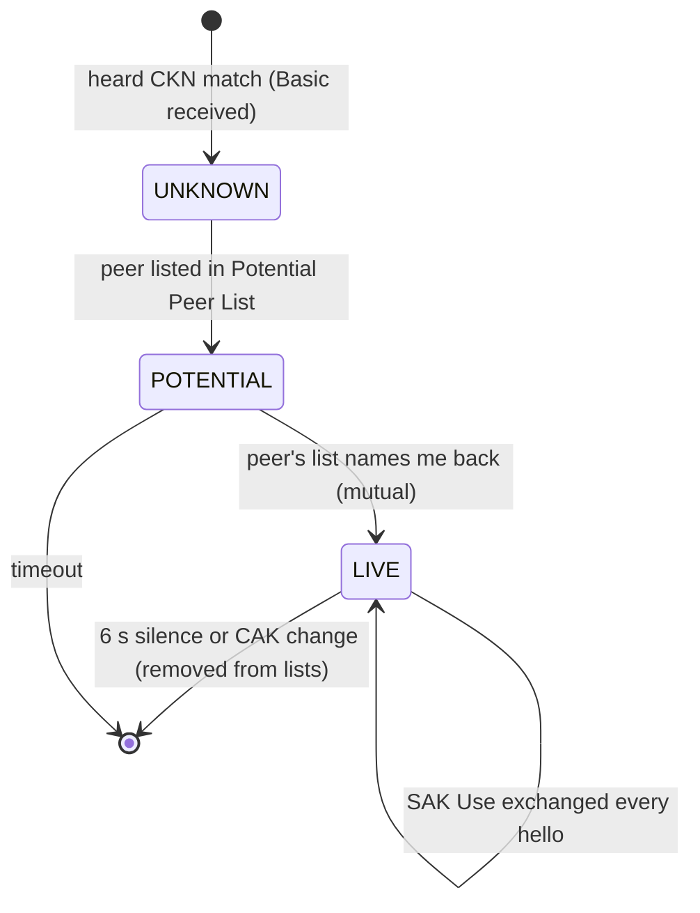

# MKA 参考手册：标识符、选举、状态与全部参数集

MKA（MACsec Key Agreement，IEEE 802.1X Clause 9/11）是 MACsec 的控制面：它选举 Key Server、分发 SAK、宣布"我在用哪把钥匙"、维持邻居存活。本文是**查阅型参考**——每张表都标了实验室抓包里的对应位置。入门顺序建议先读 [key-hierarchy.md](key-hierarchy.md)，再回来查表。

## 1. 标识符一览

| 标识符 | 长度 | 是什么 | 生成/变化 | 抓包位置 |
|---|---|---|---|---|
| **CKN** | 1..∞（实验用 16） | CA 的名字，**不是密钥**；同一 CKN+CAK = 同一 CA | PSK 配置 / EAP KDF 派生 | Basic 参数集 |
| **MI** | 12 B | 成员标识（Member Identifier），本参与者本次会话的唯一随机标识 | 每次会话开始随机生成 | Basic 的 Actor MI |
| **MN** | 4 B | 报文序号（Message Number），每发一条 MKPDU +1 | 单调递增 | Basic 的 Actor MN |
| **SCI** | 8 B | 安全通道标识 = MAC(6) ‖ Port ID(2)；每个**发送方向**一个 | 从端口地址推导 | Basic 的 SCI / SecTAG |
| **KI** | 16 B | SA 标识 = KS 的 MI(12) ‖ KN(4)；一把 SAK 的全名 | 随 SAK 分配 | SAK Use 的 KS MI + KN |
| **KN** | 4 B | Key Number，KS 给每把 SAK/CAK 的编号 | 每次分发 +1 | Distributed SAK / SAK Use |
| **SSCI** | 4 B | XPN 的短 SC 标识（同 SAK 下每个 SC 唯一） | 默认规则：SCI 最大者 0x0001 | Live Peer List 第 2 字节 |

MN 是 MKA 自己的反重放：接收方只接受 **MN 比上次大**的对端报文，重放的 MKPDU 直接作废。Peer List 里记录的正是"对端最近一次报文的 MN"。

## 2. 时间参数

| 参数 | 默认值 | 说明 |
|---|---|---|
| Hello（MKPDU 发送间隔） | **2 s** | 无事发生时就是 keepalive（Basic + Live Peer + SAK Use） |
| 对端判死 | **≈ 6 s**（3 个周期）没收到对端 MKPDU | 从 Live Peer List 摘除；受控口随之关闭 |
| Delay Protect 窗口 | 随 SAK Use（每 2 s 刷新 LLPN） | 旧帧最多活一个 hello 周期（[lifecycle.md](lifecycle.md) §3.2） |
| SAK 寿命 | 无固定值：PN 耗尽或策略强制 | KS 决定何时 rekey（[lifecycle.md](lifecycle.md) §1-2） |
| CAK 寿命 | PSK：改配置；EAP：重认证 | 换 CAK = 新 CA，全部 SAK 作废 |

## 3. Key Server 选举

KS 是 CA 里**唯一**生成和分发 SAK 的成员（一把 CAK 对应一个当选者）。每个成员在 Basic 参数集里宣告：

- **Key Server 标志位**（自己认为能不能当）+ **优先级**（1 字节）
- 选举规则：**优先级数值最小者当选；平局时 SCI 数值小者当选**。数值越小越"想当"。

实验室两条故事线都体现选举：PSK 线 A（prio 16）胜 B（32），见 `mka-handshake.pcap` 帧 1-2 的 `Key Server Priority` 字段；EAP 线 Authenticator（prio 0）固定胜 Supplicant（255），见 `mka-after-eap.pcap`。多成员 CA 里 KS 同样只有一个（`mka-multi-peer.pcap`），SAK 分发一次全体可用。

## 4. 对等体生命周期：Potential → Live

每个成员为**每个远端成员**维护一条状态：



- **Potential**：我看见了它，它还没确认看见我（或还没互认）。出现在 **Potential Peer List**（类型 2）。
- **Live**：双方互相列名，开始信任其宣告。出现在 **Live Peer List**（类型 1）。
- 晋级的可观测信号：`mka-handshake.pcap` 里 B 的 MN=1 只发 Potential List（帧 2），A 的 MN=2 起改发 Live List（帧 3）——A 先在 Basic/列表里点名了 B，B 确认后对等关系成立。

## 5. MKPDU 帧结构

MKPDU 装在 EAPOL 里：`EAPOL(版本 3, Type 5) ‖ 参数集们 ‖ ICV(16)`，目的地址固定 PAE 组地址 `01:80:C2:00:00:03`。每个参数集都是同样的四段头：

```
| 类型(1) | 参数专用(1) | flags(高4位)+BodyLength(12位)(2) | Body(...) | pad到4字节 |
```

BodyLength 只算 Body。ICV 覆盖整帧去掉 ICV 本身：`AES-CMAC(ICK, DA‖SA‖0x888E‖EAPOL−ICV)`（802.1X 9.4.1）。

## 6. 参数集逐个参考

### 6.1 Basic Parameter Set（必备，永远是第一个）

octet 1 是 **MKA 版本**（不是类型号）：**2** = 802.1X-2010（绝大多数部署），**3** = 802.1X-2020（XPN 的 SSCI 字节属于这个版本；`mka-xpn.pcap` 用 3）。

| 字段 | 位置 | 含义 |
|---|---|---|
| Version | 1 | 2 或 3 |
| KS Priority | 2 | 越小越优先 |
| KS/Desired/Cap + Len | 3-4 | bit7=Key Server，bit6=MACsec Desired，bit5-4=Capability（0 不支持 / 1 仅完整性 / 2 完整性+机密性 offset 0 / 3 再加 co 30/50），低 12 位 body 长度 |
| SCI | 5-12 | 发送方安全通道标识 |
| Actor MI | 13-24 | 发送方成员标识 |
| Actor MN | 25-28 | 报文序号 |
| Algorithm Agility | 29-32 | `00-80-C2-01` = AES-CMAC 族 |
| CKN | 33.. | CA 名字（长度可变） |

### 6.2 Live Peer List（1）/ Potential Peer List（2）

| 字段 | 位置 | 含义 |
|---|---|---|
| Param type | 1 | 1 = Live，2 = Potential |
| **KS SSCI** | 2 | 发送方自己 SC 的 SSCI **低字节**；非 XPN 一律 0，XPN 时非 0——这是识别 XPN 会话最快的方式（`mka-xpn.pcap` 帧 2+） |
| Body length | 3-4 | 16 × 成员数 |
| 对端条目 | 每条 16 B | MI(12) ‖ 已确认的对端 MN(4)；KS 的 Live List 带 2 条即 2 成员 CA（`mka-multi-peer.pcap` 帧 4） |

### 6.3 MACsec SAK Use（3）——每条 MKPDU 都可能带

声明"我在用/能收哪些 SA"。40 字节 body（不支持 MACsec 的成员 body 为空）：

| 字段 | 位置 | 含义 |
|---|---|---|
| Latest AN/tx/rx | 2 高位 | 新 SA 的关联号 + 我用它发/我能用它收 |
| Old AN/tx/rx | 2 低位 | 旧 SA（换钥过渡期），`old KN=0` 表示无 |
| plain_tx / plain_rx / **delay_protect** | 3 高位 | 是否允许明文收发；delay protect 开关 |
| Latest KS MI + KN | 4-20 | KI：哪把 SAK（KS 的 MI ‖ KN） |
| Latest lowest PN (LLPN) | 20-24 | 我仍可接受的最低 PN（delay protect 的地板） |
| Old KS MI + KN + OLPN | 24-40 | 旧钥同构，换钥排空用 |

换钥故事的三段式全在这张表里：`mka-rekey.pcap` 帧 5（latest=新 tx，old=旧 tx+rx）→ 帧 6（双 tx+rx）→ 帧 7（old 只 rx 排空）→ 帧 9（old KN=0 退役）。`mka-delay-protect.pcap` 帧 10 演示 LLPN=3 发布。

### 6.4 Distributed SAK（4）——只在换钥时出现

| 字段 | 位置 | 含义 |
|---|---|---|
| AN + offset code | 2 | 高 2 位 = AN；接着 2 位 = confidentiality offset（0→0，1→30，2→50 字节明文前缀） |
| Key Number | 5-8 | KN |
| Cipher Suite ID | 9-16（可选） | 8 字节套件 ID；**默认套件 GCM-AES-128 省略整个字段**（body 28），其余套件带（128 位 SAK body 36 / 256 位 52）——见 [cipher-suites.md](cipher-suites.md) |
| AES-KW(SAK) | 其后 | AES-KeyWrap(KEK, SAK)，比 SAK 长 8 字节（wrap IV） |

同 SAK 只分发**一次**（组密钥）：`mka-multi-peer.pcap` 全程仅一条 Distributed SAK，全体成员共用。

### 6.5 其他参数集（实验室未展开）

| 类型 | 名字 | 用途 |
|---|---|---|
| 5 | Distributed CAK | PSK 模式下 CAK 在线轮换（CAK rollover），期间新旧 CKN 并存 |
| 7/8 系列 | Announcement | 802.1X-2020 公告（能力/CS list 等），日常握手不出现 |
| 255 | ICV Indicator | 标记尾随 16 字节 ICV，永远是最后一个参数集 |

## 7. 一条 MKPDU 的最小合法内容

握手期之外，keepalive 的最小集是：**Basic + Live Peer List + SAK Use + ICV Indicator + ICV**。这也是 `mka-rekey.pcap` / `mka-delay-protect.pcap` 里所有 keepalive 帧的构成——对照 [captures/decoded/01-mka-handshake.md](../captures/decoded/01-mka-handshake.md) 的逐字段表即可逐字节读完一条真实 MKPDU。

Wireshark 过滤速查：`eapol.type == 5`（MKA）、`mka.key_server`、`mka.ks_prio < 32`、`mka.delay_protect == 1`、`mka.param_set_type == 4`（Distributed SAK）。

相关阅读：SecY 怎么消费这些钥匙 → [secy-processing.md](secy-processing.md)；密钥从 CAK 到 SAK 的派生 → [key-hierarchy.md](key-hierarchy.md)。
