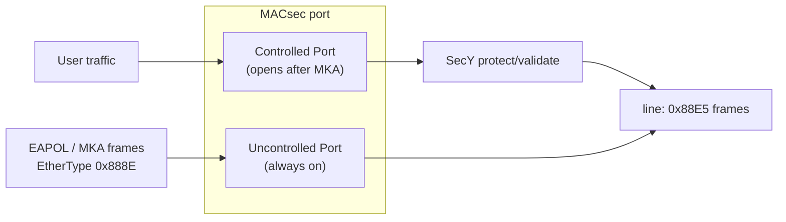
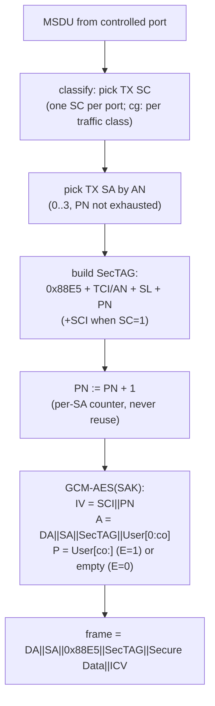
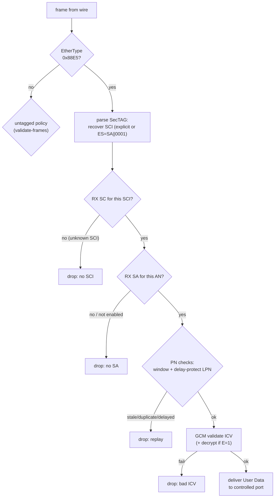

# SecY 收发处理模型：一帧穿过 MACsec 会发生什么

抓包告诉你线上长什么样；本文告诉你**两端设备里发生了什么**。SecY（MAC Security Entity，802.1AE Clause 9/10）是数据面的执行者：发送方向它"保护"帧，接收方向它"校验并去保护"帧。密钥从哪来（MKA/KaY）见 [key-hierarchy.md](key-hierarchy.md)；本文只讲数据面。

## 1. 受控口与非受控口

每个使能 MACsec 的端口在桥接模型里拆成两个逻辑口：

- **非受控口**永远放行 EAPOL（含 MKA）——否则鸡生蛋问题：加密密钥的协商流量自己就被拦了。PAE 组地址 `01:80:C2:00:00:03` 的帧也因此不被网桥转发（见 [troubleshooting.md](troubleshooting.md) 的 `group_fwd_mask`）。
- **受控口**只有在 MKA 会话建立（双方 SAK Use 都 tx+rx）之后才对用户流量"打开"。MKA 停了受控口关闭，这就是 fail-close 的标准行为（[lifecycle.md](lifecycle.md) §5）。

## 2. 发送路径（protect）

一帧从受控口进来，SecY 做 6 件事：

逐条对着实验室看（全部可在 [protocol-analysis.md](protocol-analysis.md) 逐帧验证）：

| 步骤 | 规则要点 | 实现映射 |
|---|---|---|
| 选 SC/SA | 每个发送方向一个 SC（SCI = MAC‖PortID）；换钥时 AN 0→1→2→3 轮转（[lifecycle.md](lifecycle.md) §2） | `SecTAG.build(an=…)` |
| SecTAG | 点对点可 ES=1 省略 SCI（8 字节都省）；多成员 CA 必须 SC=1 带上 SCI | `macsec-lab-encrypted.pcap` 帧 7 vs `mka-multi-peer.pcap` |
| PN | 每个 SA 独立从 1 递增；**同一 SAK 内绝不复用**（nonce 复用会击穿 GCM）；XPN 64 位，线上只带低 32 位 | `XpnPnTracker` |
| AAD | DA‖SA‖**EtherType 0x88E5**‖SecTAG‖User[0:co] 全部认证——改任何一个 bit ICV 都会挂 | `crypto.gcm_protect` |
| 加密范围 | E=1：User Data（或 co 之后）加密；E=0：P 为空只做完整性；co∈{0,30,50} 由 MKA 协商不在帧里 | `mka-co30.pcap` |
| ICV | 16 字节 GCM tag 追加帧尾 | 所有抓包 |

## 3. 接收路径（validate）

接收方向上每帧要过 5 道关，**任何一道失败都是静默丢弃**（标准不要求回错误报文——回话本身就会泄露信息）：

| 关卡 | 依据 | 实验室演示 |
|---|---|---|
| 未知 SCI | 帧不属于任何已建立的 RX SC（对端还没分发 SAK / 伪造 SCI） | 概念层：`parse_frame` 的 `sci_hint` 失败路径 |
| 无 SA / AN 未启用 | SCI 对但该 AN 没有**启用中**的 SA（换钥过渡期常见） | `mka-rekey.pcap` 双 SA 并存 |
| 重放窗口 | §3.1 四种裁决 | `macsec-replay.pcap` + `ReplayWindow` |
| Delay Protect | PN < 对端宣告 LLPN → 丢弃 | `mka-delay-protect.pcap` + `set_delay_floor()` |
| ICV | GCM tag 校验失败 → 丢弃 | `tests` 的 tamper 用例（翻 1 个 bit 必挂） |

XPN 的接收差异只有一处：线上 PN 是 64 位中的低 32 位，接收端用 SA 状态恢复高 32 位（大步回跳=回绕，小步回跳=乱序），nonce 是 (SSCI‖PN64)⊕Salt 而非 SCI‖PN——见 [cipher-suites.md](cipher-suites.md) §3 与 `mka-xpn.pcap`。

## 4. Validate Frames：未保护帧怎么办

前三道关处理的是"声称受保护"的帧；还有一类是**没穿 SecTAG 的明文帧**（untagged）。802.1AE 给三种策略：

| 模式 | tagged 帧 ICV 挂 | untagged 帧 | 典型用途 |
|---|---|---|---|
| **Strict** | 丢弃 | 丢弃 | 机密性链路的标准姿势（fail-close） |
| **Checked** | 丢弃 | 按明文接收（可审计） | 混合网过渡期、监控 |
| **Disabled** | 不校验 ICV，直接解开 | 按明文接收 | 分路/诊断，**不提供保护** |

Linux `ip macsec` 里对应 `validate strict|check|disabled`（默认 strict）；wpa_supplicant 的 `macsec_policy=1` 隐含 strict 期望。生产上开 Checked/Disabled 等于把完整性降级成"尽力而为"，是 [attacks.md](attacks.md) 里 fail-open 一行的根源。

## 5. 丢弃是静默的，怎么知道丢了

标准定义了一组每 SA/每 SC 计数器，是运维判断"MACsec 是否健康"的主要依据（对应 [deployments.md](deployments.md) 的监控清单、[troubleshooting.md](troubleshooting.md) 的排查矩阵）：

| 计数器 | 含义 | 常见原因 |
|---|---|---|
| `InPktsUnknownSCI` | SCI 不认识 | 对端先发数据后完成 MKA；SCID 配错 |
| `InPktsNoSA` / `InPktsSANotInUse` | AN 没有启用中的 SA | 换钥过渡不同步 |
| `InPktsBadTag` | ICV 校验失败 | **密钥不一致 / 线路误码 / 被篡改** |
| `InPktsLate` / `InPktsNotUsingSA` | 重放窗口/Delay Protect 丢弃 | 真乱序超窗、路径时延 > MKA 周期 |
| `InPktsUntagged` | untagged 帧按策略丢弃 | 对端没开 MACsec、策略是 strict |

排查口诀：`BadTag` 涨 → 查密钥（CAK/CKN/SAK）；`UnknownSCI` 涨 → 查 MKA 会话与 SCI 配置；`Late` 涨 → 查网络时延与 delay protect 配置。

## 6. 与本仓库的对应

- 发送路径的每一步 = `macsec_lab/macsec.py: protect_frame()`；接收路径 = `parse_frame()` + `ReplayWindow` + `XpnPnTracker`。
- 五道关里能在**抓包上直接看到**的：SA/AN（SecTAG）、PN、ICV；SCI 查找与策略丢弃是设备内部行为，抓包只能看到"帧还在路上"。
- 想亲眼看丢弃：`make test` 里有 tamper（ICV 关）、replay（窗口关）、delay floor（LPN 关）三类用例。

下一篇：MKA 怎么把 SAK 送到 SecY 手里 —— [mka-reference.md](mka-reference.md)。
