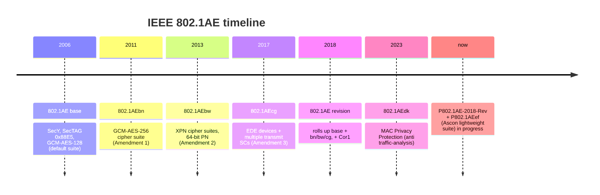

# 标准地图与演进时间线

MACsec 是 IEEE 的地盘：**802.1AE 定义数据面（SecY），802.1X 定义控制面密钥协商（MKA）**。没有替代 802.1AE 的 IETF RFC；IETF 侧只有配套的 YANG/MIB 管理模型。

## 1. 802.1AE 演进（数据面）

| 标准 | 年份 | 带来了什么 | 本仓库映射 |
|---|---|---|---|
| 802.1AE | 2006 | SecY、SecTAG、SCI/PN、GCM-AES-128 默认套件 | `macsec_lab/macsec.py`，全部基础抓包 |
| 802.1AEbn | 2011 | GCM-AES-256（Amendment 1） | `IEEE_GCM_KEY_256` 向量逐字节测试，`captures/macsec-ieee-gcm-aes-256-*.pcap` |
| 802.1AEbw | 2013 | XPN：64-bit PN + SSCI + Salt（Amendment 2） | `crypto.xpn_iv()`，[cipher-suites.md](cipher-suites.md) §3 |
| 802.1AEcg | 2017 | EDE（以太网数据加密设备，透明加密盒）+ 单端口多条发送 SC（应对帧抢占/乱序下的严格重放保护） | 不在实验室范围（点对点单 SC） |
| 802.1AE-2018 | 2018 | **现行版**：合入上述全部修正案（+Cor1 勘误） | 本仓库按 2018 版行为编写 |
| 802.1AEdk | 2023 | MAC Privacy Protection：填充/整形对抗流量分析 | 不在范围；[attacks.md](attacks.md) 提到元数据泄露 |

进行中：**P802.1AE-2018-Rev**（新修订）与 **P802.1AEef**（Ascon 轻量套件，面向 IoT/汽车）。

## 2. 802.1X 演进（控制面：EAPOL 与 MKA）

| 标准 | 年份 | 带来了什么 | 本仓库映射 |
|---|---|---|---|
| 802.1X | 2001 | EAPOL、基于端口的接入认证 | EAPOL 头/Type 0（详见 [IEEE_802.1X_Lab](https://github.com/johnfu-ai/IEEE_802.1X_Lab)） |
| 802.1X | 2004 | 修订 | — |
| 802.1X | 2010 | **MKA**（KaY 状态机、MKPDU、CAK/KEK/ICK KDF、EAPOL v3）；与 802.1AE 联动 | `macsec_lab/mka.py`、`keys.py` 全部 KDF |
| 802.1X | 2014 | 修订 | — |
| 802.1X | 2020 | **现行版** | 本仓库按 2020 版行为编写（Algorithm Agility、SSCI 等） |

MKA 是 2010 年才进入 802.1X 的——此前 802.1AE-2006 的密钥怎么来没有标准答案，这正是 PSK/EAP 两条故事线的历史背景（[key-hierarchy.md](key-hierarchy.md)）。

## 3. 周边生态

| 项 | 是什么 | 关系 |
|---|---|---|
| 802.1Q | 桥接/VLAN；PAE 组地址转发表规则（`01:80:C2:00:00:03` 不转发） | Linux 网桥要设 `group_fwd_mask=8` 才能跑 MKA（[troubleshooting.md](troubleshooting.md)） |
| 802.1AR | Secure Device Identity（DevID） | 设备身份证书，常用于 EAP-TLS → MSK → CAK 链路 |
| Cisco TrustSec | 早期商用 LinkSec/MACsec 的市场化名称 | 事实上的互操作压力来源 |
| RFC 9191 等 | MACsec 的 YANG 管理模型 | 只管管理面，不碰协议 |

## 4. 条款级对照（学的时候按图索骥）

| Topic | Spec | Lab mapping |
|---|---|---|
| SecTAG, SecY, PN, SCI | IEEE 802.1AE-2018 Clause 7–10 | `macsec_lab/macsec.py`, [macsec-protocol-analysis.md](macsec-protocol-analysis.md) |
| GCM-AES-128 IV/AAD/ICV | 802.1AE-2018 Clause 14 | `macsec_lab/crypto.py` `gcm_protect` |
| GCM-AES-256 | 802.1AEbn-2011（并入 2018 版 Clause 14） | 256 向量测试 + 256 pcap |
| XPN（64-bit PN/SSCI/Salt） | 802.1AEbw-2013（并入 2018 版 Clause 14.7/14.8） | `xpn_iv`，[cipher-suites.md](cipher-suites.md) |
| Confidentiality offset | 802.1AE-2018 Clause 9.9 | `mka-co30.pcap`，[macsec-protocol-analysis.md](macsec-protocol-analysis.md) §4b |
| Published GCM vectors | [Randall 2011](https://ieee802.org/1/files/public/docs2011/bn-randall-test-vectors-0511-v1.pdf) | `tests/test_protocol.py`（128 与 256 双套逐字节）, `captures/macsec-ieee-gcm-aes-*.pcap` |
| MKA, KaY, MKPDU | IEEE 802.1X-2020 Clause 9, 11 | `macsec_lab/mka.py` |
| KDF, KEK, ICK | 802.1X 6.2.1, 9.3.3 | `derive_kek` / `derive_ick`, [key-hierarchy.md](key-hierarchy.md) |
| CAK/CKN from EAP MSK | 802.1X 6.2.2 | `derive_eap_cak` / `derive_eap_ckn`, `mka-after-eap.pcap` |
| SAK generation / wrap | 802.1X 9.8 / Figure 11-11 | Key Server generates SAK; `wrap_sak`; not `KDF(CAK)` |
| Rekey / SAK lifecycle | 802.1X 9.x, 802.1AE 10.x | `mka-rekey.pcap`, [lifecycle.md](lifecycle.md) |
| MKPDU ICV | 802.1X 9.4.1 | `mka_icv_input` |
| AES-CMAC | IETF RFC 4493 | `aes_cmac` |
| AES Key Wrap | IETF RFC 3394 / 802.1X 9.8.2 | `wrap_sak` |
| EAPOL type table | 802.1X Table 11-3 | Type 5 = EAPOL-MKA |
| YANG (management only) | RFC 9191 etc. | not in lab |

Sources: [IEEE 802.1 Security TG](https://1.ieee802.org/security/) · [802.1AE project page](https://1.ieee802.org/security/802-1ae/)
